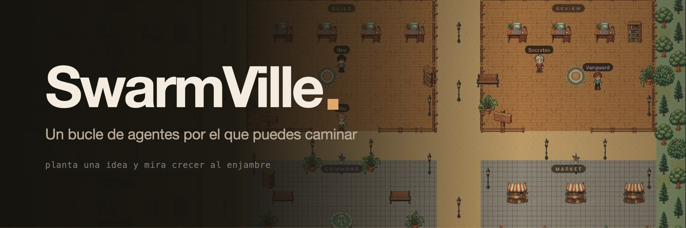

<div align="center">



Cinco agentes, cinco cuartos, un pueblo. Mira el bucle mientras ocurre, en vez de leerlo después.

[](LICENSE)
[](https://nodejs.org)
[](#proveedores)

[English](README.md) · Español · [中文](README.zh-CN.md)

</div>

---

## El problema

Un bucle de agentes es un muro de texto. Planear, construir, revisar, corregir,
verificar: cinco llamadas al modelo que pasan más rápido de lo que puedes leerlas,
y cuando algo falla acabas subiendo por el log a ver cuál de los pasos se rompió.

La información nunca fue el problema. Lo era la **forma**. Un log es un mal medio
para algo que en realidad son cinco actores, un relevo y un ciclo.

Así que SwarmVille dibuja el bucle como un lugar. Atlas de pie en su escritorio del
cuarto de Plan, con un aro encendido a sus pies: eso es una llamada al modelo en
curso. Un arco entre Neo y Socrates: eso es el relevo. Socrates caminando de vuelta
hacia Neo: el revisor pidió corregir. No lees el estado, lo miras.

## Arranque

Node 20+.

```bash
npm install
npm run dev
```

Abre <http://127.0.0.1:5173>. Eso levanta Vite en el 5173 y el relay en el 8765;
Vite hace de proxy para `/api` y `/ws`, así que el navegador sólo habla con un
origen.

No hace falta ninguna API key. El proveedor `mock` que viene por defecto corre el
bucle entero sin conexión, ciclo de corrección incluido, así que el pueblo está
vivo desde el primer arranque.

Camina con **WASD** o haz clic en el suelo. Escribe un objetivo en la barra de
abajo y mira a los cinco agentes hacerlo.

## El bucle

```
plan ──▶ build ──▶ review ──┬── PASS ──▶ verify ──▶ archive
            ▲               │
            └─── REVISE ────┘   (con tope en MAX_REVISIONS)
```

Cada fase es una llamada al modelo hecha por un agente. El veredicto del revisor es
lo que cierra el ciclo: `VERDICT: REVISE` devuelve el control al constructor.

| Agente | Fase | Cuarto |
|---|---|---|
| Atlas | Planear | Plan |
| Neo | Construir | Build |
| Socrates | Revisar | Review |
| Vanguard | Verificar | Review |
| Alexandria | Archivar | Memory |

## Nada de lo que ves está inventado

Cada llamada al modelo queda registrada como un **paso**, y cada paso lleva su
latencia real, los tokens de entrada y de salida, el número de intento, la salida
completa y el motivo del fallo si falló. Dónde está parado un agente y si tiene el
aro encendido sale de esos mismos registros, no de una animación de progreso que
adivina.

El XP y las recompensas son estado del juego, propiedad del huerto. Nunca se
disfrazan de confianza del modelo ni de una nota de calidad inventada.

## El huerto

El bucle jugable alrededor del bucle de agentes. Siembras un producto, lo mandas al
enjambre, y el plantío avanza por plan, diseño, construcción, revisión,
verificación y entrega conforme la ejecución emite pasos reales. Entre ejecuciones
lo riegas con energía, compras fertilizante en el mercado, completas encargos del
pueblo y cosechas la entrega para ganar monedas, gemas y XP.

Un plantío entregado abre el **Estudio de Producto**: editas el HTML, CSS,
JavaScript o README generado, publicas revisiones, las previsualizas en un iframe y
te descargas una app de un solo archivo lista para correr. El perfil y los plantíos
se guardan en el almacenamiento local del navegador.

## La plaza

Entra a la plaza y te unes a la sala: el relay te pasa la lista de quienes ya están
ahí y tu navegador abre una conexión WebRTC con cada uno. El audio y el video van
punto a punto — el relay sólo reenvía SDP e ICE.

Puedes rechazar el permiso de cámara sin problema: entras como oyente. El STUN
público cubre la misma máquina y la misma red local; cruzar un NAT simétrico
requiere un servidor TURN (mira `.env.example`).

## Proveedores

Elige uno en la barra superior, o pon `PROVIDER` en el `.env`.

| id | Qué es | Necesita |
|---|---|---|
| `mock` | Simulador sin conexión. El de por defecto. | nada |
| `ollama` | Modelos locales vía Ollama | Ollama corriendo en local |
| `anthropic` | Claude por la API de Anthropic | `ANTHROPIC_API_KEY` |

Las llaves las lee el relay del entorno y nunca llegan al navegador. Si un
proveedor no se puede construir, el relay cae a `mock` y marca el selector, en vez
de fallar en silencio.

## El arte

Cada tile, cada objeto y cada personaje están generados con `gpt-image-2` y luego
reducidos a una rejilla de píxeles. `art/manifest.json` guarda un prompt por asset,
`tools/genart.mjs` los genera y `tools/pixelize.py` recorta, reduce, endurece el
alfa, cuantiza a 64 colores y empaqueta un solo atlas. Las hojas de personaje son
una imagen con cuatro poses, separadas por las columnas vacías que quedan entre
ellas.

```bash
npm run art                        # genera lo que falte y vuelve a empaquetar
python3 tools/pixelize.py --selftest
```

Sólo se commitean `public/art/atlas.png` y `atlas.json`. Los 29 MB de imágenes
crudas son intermedios; regenerarlas cuesta alrededor de $1.40.

El renderer dibuja el mundo en un canvas fuera de pantalla a resolución de arte y
lo amplía por un factor entero, así todos los píxeles miden lo mismo y ninguno
queda a medio interpolar. Las etiquetas se dibujan después a resolución del
dispositivo, donde importa más que se lean que la pureza del píxel.

## API HTTP

El relay se usa sin la interfaz.

```bash
curl localhost:8765/api/health
curl localhost:8765/api/state
curl -X POST localhost:8765/api/runs \
  -H 'content-type: application/json' \
  -d '{"goal":"Añadir rate limiting a la API REST pública"}'
curl -X POST localhost:8765/api/runs/stop
```

El WebSocket en `/ws` empuja mensajes `snapshot`, `run`, `step`, `event`, `agent`,
`handoff`, `provider`, de presencia y de señalización WebRTC.

## Estructura

```
server/
  index.js          HTTP + WebSocket, middleware de seguridad
  orchestrator.js   el bucle de agentes
  security.js       límites de tasa, chequeo de origen, tope de cuerpo, saneo
  rooms.js          presencia + señalización WebRTC
  providers/        mock, ollama, anthropic
src/
  world/
    World.ts        el renderer 2D
    map.ts          el trazado del pueblo
    theme.ts        paleta, rejilla de tiles, rectángulos de los cuartos
    atlas.ts        cargador del spritesheet
  ui/               paneles
  lib/              cliente WebSocket, malla WebRTC
art/manifest.json   cada sprite con su prompt
tools/              generar el arte, empaquetar el atlas
assets/             banner y kit de marca
```

## Scripts

```bash
npm run dev        # relay + web
npm run relay      # sólo el relay
npm run typecheck  # tsc --noEmit
npm run build      # typecheck + bundle de producción
npm run art        # regenerar el spritesheet
```

## Seguridad

Local por defecto: escucha en `127.0.0.1`, valida orígenes contra una lista, y
**no tiene autenticación**. Lee [SECURITY.md](SECURITY.md) antes de ponerlo en una
red.

## Licencia

MIT — ver [LICENSE](LICENSE).
