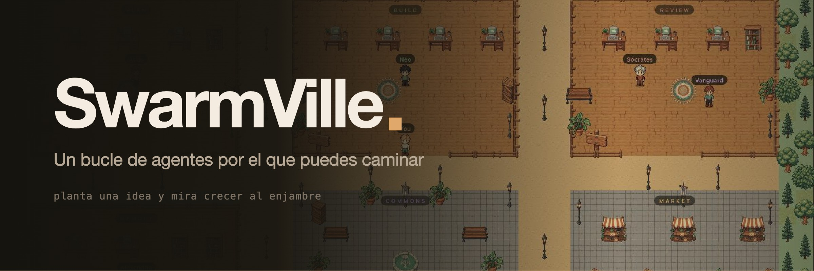

<div align="center">



Deja un agente trabajando en una oficina compartida. Arrástralo al piso, apoya las ideas de otras personas, habla cara a cara.

[](LICENSE)
[](https://nodejs.org)
[](#proveedores)

[English](README.md) · Español · [中文](README.zh-CN.md)

</div>

---

## Qué es

Un bucle de agentes es un muro de texto. SwarmVille lo dibuja como una oficina por la
que puedes caminar, y lo convierte en algo que varias personas hacen juntas:

- **Deja un agente.** Escribe lo que quieres, luego levanta a tu agente y suéltalo
  donde quieras en el piso. Se queda ahí trabajando mientras tú haces otra cosa.
- **Apoya una idea.** Las ideas de todos esperan en una sola fila, el **Tablón**.
  Apoyar una la sube, así que la gente decide qué construye el enjambre después.
- **Habla cara a cara.** Entra a la sala común y tu cámara aparece sobre tu cabeza,
  en una burbuja squircle. El video va de persona a persona.

Sin pantalla de configuración, sin jerga: un campo, un botón, un gesto.

## Arranque

Node 22+.

```bash
npm install
npm run dev
```

Abre <http://127.0.0.1:5173>. Eso levanta Vite en 5173 y el relay en 8765; Vite hace
proxy de `/api` y `/ws`, así el navegador solo habla con un origen.

No hace falta API key. El proveedor por defecto, `agy`, necesita la CLI de
Antigravity; sin ella el relay cae al simulador `mock`, que corre el bucle completo,
con su ciclo de corrección, y te devuelve una páginita web de verdad.

Camina con **WASD** o toca el piso. **Esc** vuelve a la vista general.

## Dejar un agente

1. Escribe tu idea en la barra de abajo, o toca una de las sugerencias.
2. Pulsa **Dejar mi agente**, o agarra al agente de color a la izquierda de la barra y
   suéltalo donde quieras. El cursor de guante se cierra sobre él; un anillo marca
   dónde va a caer, y cae desde arriba.
3. Se queda ahí con tres puntitos que saltan mientras el enjambre trabaja. Haz clic
   en él para encontrar su tarjeta en el Tablón.

Arrastrar usa eventos de puntero, no el drag-and-drop de HTML, así que también
funciona con el dedo. **Esc** devuelve al agente a la barra.

## La fila

Un enjambre, muchas personas: las ideas se turnan. El relay guarda una sola fila:

- la idea que corre va primero; el resto se ordena por cuántas personas la apoyan y
  después por quién llegó antes;
- no puedes apoyar tu propia idea, y apoyar dos veces lo deshace;
- puedes retirar tus ideas en espera y detener tu propia corrida;
- quien se va pierde sus ideas en espera y sus votos. Una corrida que ya empezó sigue:
  dejar un agente y alejarse es justamente la idea.

Los límites son `QUEUE_MAX` (12 ideas en total) y `JOBS_PER_PEER` (2 por persona).

## Lo que recibes

Cuando una corrida termina, lo que entregó el constructor se abre en una tarjeta. Si
el objetivo era algo que corre en un navegador, el constructor entrega una página HTML
autocontenida y la ves funcionando en una vista previa aislada. **Publicar enlace** la
escribe en `.data/releases/` y copia una dirección que el relay sirve en `/r/<id>`;
**Descargar** te da el archivo. Si no, recibes el resumen en lenguaje sencillo.

A propósito no es Vercel ni GitHub. Una herramienta que escucha en `127.0.0.1` y no
tiene autenticación no debería guardar un token de despliegue. La página se sirve con
`Content-Security-Policy: sandbox`: corre, pero no puede leer el almacenamiento de
esta app; mira [SECURITY.md](SECURITY.md).

## Detalles que lo hacen sentir vivo

- **Reacciones.** Pulsa del **1** al **5** (o la carita de la barra) y 👋 👏 ❤️ 🔥 🎉
  suben desde tu cabeza, para que todos las vean.
- **Sonido.** Un golpecito suave al soltar a tu agente, un tic al apoyar una idea y
  una campanita cuando termina una corrida. Se sintetiza al momento, sin archivos de
  audio; se apaga en Ajustes.
- **Una racha.** Deja una idea en días seguidos y aparece una llama en la barra.
  Vive solo en tu navegador: es un empujoncito para volver, no una cuenta.
- **El estante.** Bajo el Tablón, lo último que construyó el enjambre, a un clic de su
  resultado. Cuando termina la idea de otra persona te avisa con un toque discreto.
- **Vida.** Los agentes sin tarea estiran las piernas; el título de la pestaña dice qué
  pasa mientras estás en otro lado y celebra cuando algo termina.

Todo lo que se abre también se va, con animación, y los cuadros por segundo se mantienen en 60.

## Llevarlo a Jean

[Jean](https://jean.build) es donde ocurre el trabajo en un repositorio de verdad:
worktrees, sesiones, tus propios agentes de terminal. No tiene una API pública que
llamar, así que el puente es el honesto. En una tarjeta de resultado, **Llevar a Jean**
copia un resumen (objetivo, plan, lo construido, la revisión) para pegarlo en cualquier
chat de Jean, y abre tu Jean si le diste la dirección en Ajustes. Esa dirección puede
llevar un token, así que se queda en tu navegador y nunca se manda al relay.

## Despliegue

Un solo proceso sirve la app y el relay: `npm run build && npm start`, o Docker.
Con `ACCESS_CODE` se vuelve una oficina privada; **Copiar enlace de invitación** en
Ajustes da un enlace que deja entrar directo. También hay un plano de un clic
para Render (`render.yaml`). Mira [DEPLOY.md](DEPLOY.md).

## El bucle

```
plan ──▶ build ──▶ review ──┬── PASS ──▶ verify ──▶ archive
            ▲               │
            └─── REVISE ────┘   (acotado por MAX_REVISIONS)
```

Cada fase es una llamada al modelo hecha por un agente, y el veredicto del revisor
cierra el bucle: `VERDICT: REVISE` devuelve el control al constructor.

| Agente | Fase | Cuarto |
|---|---|---|
| Atlas | Plan | Plan |
| Neo | Build | Build |
| Socrates | Review | Review |
| Vanguard | Verify | Review |
| Alexandria | Archive | Memoria |

Con `DECOMPOSE=1` el constructor toma el plan paso a paso, una llamada al modelo por
paso. Cuesta una llamada por paso, por eso viene apagado.

Nada de lo que ves está inventado. Cada llamada al modelo es un **paso** con su
latencia, tokens, intento y salida completa; dónde está parado un agente y si está
pensando sale de esos registros, no de una animación que adivina.

## El archivo

Alexandria escribe una línea JSON por corrida terminada en `.data/archive.jsonl`: el
objetivo, su nota, el resultado y lo que costó. Haz clic en ella para abrir la memoria
y buscar. JSONL porque una línea es el registro completo, `tail -f` funciona, y una
línea corrupta cuesta una corrida en vez del archivo. `ARCHIVE_FILE` lo mueve.

## Proveedores

Elige uno en la barra superior, o pon `PROVIDER` en el `.env`.

| id | Qué es | Necesita |
|---|---|---|
| `agy` | Gemini 3.6 Flash por el CLI de Antigravity. El de por defecto. | `agy` en el PATH |
| `agy-pro` | Gemini 2.5 Pro por el CLI de Antigravity | `agy` en el PATH |
| `crosstalk` | El puente crosstalk (`crosstalk.sh ask`) | `agy` en el PATH y `CROSSTALK_SCRIPT` |
| `claude` | Claude Code sin interfaz (`claude -p`) | `claude` en el PATH |
| `ollama` | Modelos locales vía Ollama | Ollama corriendo en local |
| `anthropic` | Claude por la API de Anthropic | `ANTHROPIC_API_KEY` |
| `mock` | Simulador sin conexión. El de respaldo. | nada |

Las llaves las lee el relay del entorno y nunca llegan al navegador. Si un
proveedor no se puede construir, el relay cae a `mock` y marca el selector, en vez
de fallar en silencio.

## El arte

Cada tile, cada objeto y cada personaje están generados con `gpt-image-2` y luego
reducidos a una rejilla de píxeles. `art/manifest.json` guarda un prompt por asset,
`tools/genart.mjs` los genera y `tools/pixelize.py` recorta, reduce, endurece el
alfa, cuantiza a 64 colores y empaqueta un solo atlas. Las hojas de personaje son
una imagen con cuatro poses, separadas por las columnas vacías que quedan entre
ellas.

```bash
export RELAY_URL=https://host/openai RELAY_KEY=…  # cualquier API de imágenes compatible con OpenAI
npm run art                        # genera lo que falte y vuelve a empaquetar
python3 tools/pixelize.py --selftest
```

Sólo se commitean `public/art/atlas.png` y `atlas.json`. Los 29 MB de imágenes
crudas son intermedios; regenerarlas cuesta alrededor de $1.40.

El renderer dibuja el mundo en un canvas fuera de pantalla a resolución de arte y
lo amplía por un factor entero, así todos los píxeles miden lo mismo y ninguno
queda a medio interpolar. Las etiquetas se dibujan después a resolución del
dispositivo, donde importa más que se lean que la pureza del píxel.

## API HTTP

El relay se puede usar sin la interfaz.

```bash
curl localhost:8765/api/health
curl localhost:8765/api/state
# 201 {run} si el enjambre estaba libre, 202 {queued, job} si entró a la fila
curl -X POST localhost:8765/api/runs \
  -H 'content-type: application/json' \
  -d '{"goal":"Una landing para mi clase de yoga"}'
curl -X POST localhost:8765/api/runs/stop
curl 'localhost:8765/api/archive?q=yoga'
curl -X POST localhost:8765/api/releases -d '{"html":"<!doctype html><h1>hola</h1>"}'
```

El WebSocket en `/ws` empuja `snapshot`, `run`, `step`, `event`, `agent`, `handoff`,
`queue`, `provider`, presencia y señalización WebRTC. Acepta `run:start {goal, at?}`,
`run:stop`, `queue:back {id}`, `queue:cancel {id}`, `presence:name`, `presence:move`,
`room:join`, `room:leave` y `rtc:signal`. Una corrida pertenece a la conexión que la
dejó; solo esa conexión puede detenerla.

## Estructura

```
server/
  index.js          HTTP + WebSocket, middleware de seguridad
  queue.js          la fila compartida de ideas (pura, con pruebas)
  orchestrator.js   el bucle de agentes
  archive.js        una línea JSON por corrida terminada
  releases.js       publica y sirve una entrega de un solo archivo
  security.js       límites de tasa, orígenes, tamaños, saneado
  rooms.js          presencia + señalización WebRTC
  providers/        agy, claude, crosstalk, ollama, anthropic, mock
src/
  world/
    World.ts        el render 2D y el punto de soltar
    map.ts          el plano de la oficina
    sprites.ts      pisos, paredes y muebles, dibujados en código
    theme.ts        paleta, cuadrícula, rectángulos de las salas
    atlas.ts        carga del spritesheet de personajes
  ui/               la barra, el Tablón, la píldora de progreso, el resultado, la llamada
  lib/              hooks del relay y la llamada, arrastre, i18n (es/en), malla WebRTC
public/cursors/     los cursores de guante
art/manifest.json   cada personaje y su prompt
tools/              generar arte, empaquetar el atlas
```

## Scripts

```bash
npm run dev        # relay + web
npm run relay      # solo el relay
npm start          # la app compilada y el relay en un solo proceso
npm test           # las reglas de la fila
npm run typecheck  # tsc --noEmit
npm run build      # typecheck + bundle de producción
npm run art        # regenerar el spritesheet
```

## Seguridad

Local primero: escucha en `127.0.0.1`, permite solo ciertos orígenes y **no tiene
autenticación**. Quien pueda llegar al relay comparte un enjambre, una fila y un
presupuesto de llamadas al modelo; la propiedad es por conexión, no por cuenta. Lee
[SECURITY.md](SECURITY.md) antes de ponerlo en una red.

## Licencia

MIT — ver [LICENSE](LICENSE).
