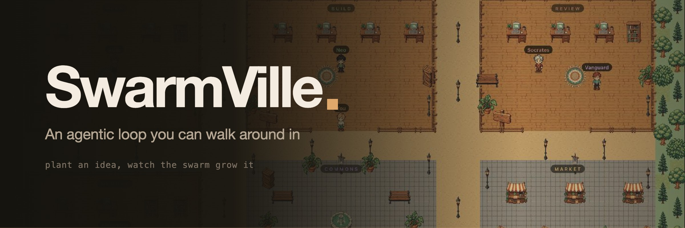

<div align="center">



Five agents, five rooms, one town. Watch the loop happen instead of reading about it afterwards.

[](LICENSE)
[](https://nodejs.org)
[](#providers)

English · [Español](README.es.md) · [中文](README.zh-CN.md)

</div>

---

## The problem

An agentic loop is a wall of text. Plan, build, review, revise, verify — five model
calls that scroll past faster than you can read them, and by the time it fails you
are scrolling back up trying to work out which step went wrong and why.

The information was never the problem. The **shape** was. A log is a bad medium for
something that is really five actors, a handoff, and a cycle.

So SwarmVille renders the loop as a place. Atlas is standing at a desk in the Plan
room with a lit ring: that is a model call in flight. An arc between Neo and
Socrates: that is the handoff. Socrates walking back to Neo: the reviewer said
revise. You do not read the state, you look at it.

## Quick start

Node 20+.

```bash
npm install
npm run dev
```

Open <http://127.0.0.1:5173>. That starts Vite on 5173 and the relay on 8765;
Vite proxies `/api` and `/ws`, so the browser only ever talks to one origin.

No API key required. The default `mock` provider runs the whole loop offline,
revise cycle included, so the town is alive on first boot.

Walk with **WASD** or click the ground. Type an objective in the bar at the bottom
and watch five agents do it.

## The loop

```
plan ──▶ build ──▶ review ──┬── PASS ──▶ verify ──▶ archive
            ▲               │
            └─── REVISE ────┘   (bounded by MAX_REVISIONS)
```

Each phase is one model call by one agent. The reviewer's verdict closes the loop:
`VERDICT: REVISE` sends control back to the builder.

| Agent | Phase | Room |
|---|---|---|
| Atlas | Plan | Plan |
| Neo | Build | Build |
| Socrates | Review | Review |
| Vanguard | Verify | Review |
| Alexandria | Archive | Memory |

## Nothing on screen is invented

Every model call is recorded as a **step**, and every step carries wall-clock
latency, input and output tokens, the attempt number, the full output, and the
failure reason if it failed. Where an agent is standing and whether its ring is
lit are derived from those same records — not from a progress animation that
guesses.

Product XP and rewards are game state owned by the garden. They are never dressed
up as model confidence or an invented quality score.

## The archive

Runs live in a ring buffer of 25 and die with the process, which made
Alexandria's phase the one step in the loop nobody could ever read again. She
now writes one JSON line per finished run to `.data/archive.jsonl` — the goal,
her note, the outcome and what it cost — and the Memory room is where you read
them back. Click Alexandria, open the archive, search across goals and notes.

JSONL rather than a database because a line is the whole record, `tail -f` works
on it, and a corrupt line costs you one run instead of the archive. Set
`ARCHIVE_FILE` to move it.

## The garden

The playable loop around the agentic loop. Plant a product, send it to the swarm,
and the plot advances through plan, design, build, review, verify and ship as the
run emits real steps. Tend it with energy between runs, buy fertilizer at the
market, complete village quests, and harvest the shipped release for coins, gems
and XP.

A shipped plot opens **Product Studio**: edit the generated HTML, CSS, JavaScript
or README, publish revisions, preview them in an iframe, and download a runnable
single-file app. Profile and plots persist in local storage.

## The commons

Walk into the plaza and you join the room: the relay hands you the peers already
there and your browser opens a WebRTC connection to each. Media is peer-to-peer —
the relay only forwards SDP and ICE.

Declining the camera prompt is fine, you join as a listener. Public STUN covers the
same machine and the same LAN; crossing a symmetric NAT needs a TURN server (see
`.env.example`).

## Providers

Pick one in the top bar, or set `PROVIDER` in `.env`.

| id | What it is | Needs |
|---|---|---|
| `mock` | Offline simulator. The default. | nothing |
| `ollama` | Local models over Ollama | Ollama running locally |
| `anthropic` | Claude via the Anthropic API | `ANTHROPIC_API_KEY` |

Keys are read by the relay from the environment and never reach the browser. If a
provider cannot be constructed the relay falls back to `mock` and marks the
selector, instead of failing silently.

## The art

Every tile, prop and character is generated with `gpt-image-2` and then reduced to
a pixel grid. `art/manifest.json` holds one prompt per asset, `tools/genart.mjs`
generates them, and `tools/pixelize.py` crops, downscales, hardens the alpha,
quantises to 64 colours and packs a single atlas. Character sheets are one image
of four poses, split on the empty columns between them.

```bash
npm run art                        # generate whatever is missing, then repack
python3 tools/pixelize.py --selftest
```

Only `public/art/atlas.png` and `atlas.json` are committed. The 29 MB of raw
frames are intermediates; regenerating them costs about $1.40.

The renderer draws the world into an offscreen canvas at art resolution and blows
it up by a whole-number factor, so every pixel on screen is the same size and
nothing is ever half-interpolated. Labels are drawn afterwards at device
resolution, where legibility beats pixel purity.

## HTTP API

The relay is usable without the UI.

```bash
curl localhost:8765/api/health
curl localhost:8765/api/state
curl -X POST localhost:8765/api/runs \
  -H 'content-type: application/json' \
  -d '{"goal":"Add rate limiting to the public REST API"}'
curl -X POST localhost:8765/api/runs/stop
curl 'localhost:8765/api/archive?q=rate%20limiting'
```

The WebSocket at `/ws` pushes `snapshot`, `run`, `step`, `event`, `agent`,
`handoff`, `provider`, presence and WebRTC signalling messages.

## Layout

```
server/
  index.js          HTTP + WebSocket, security middleware
  orchestrator.js   the agentic loop
  archive.js        one JSON line per finished run
  security.js       rate limits, origin checks, body caps, sanitising
  rooms.js          presence + WebRTC signalling
  providers/        mock, ollama, anthropic
src/
  world/
    World.ts        the 2D renderer
    map.ts          the village layout
    theme.ts        palette, tile grid, room rects
    atlas.ts        spritesheet loader
  ui/               panels, including the archive
  lib/              WebSocket client, WebRTC mesh
art/manifest.json   every sprite and its prompt
tools/              generate art, pack the atlas
assets/             banner and brand kit
```

## Scripts

```bash
npm run dev        # relay + web
npm run relay      # relay only
npm run typecheck  # tsc --noEmit
npm run build      # typecheck + production bundle
npm run art        # regenerate the spritesheet
```

## Security

Local-first by default: binds `127.0.0.1`, allowlists origins, and has **no
authentication**. Read [SECURITY.md](SECURITY.md) before putting it on a network.

## License

MIT — see [LICENSE](LICENSE).
