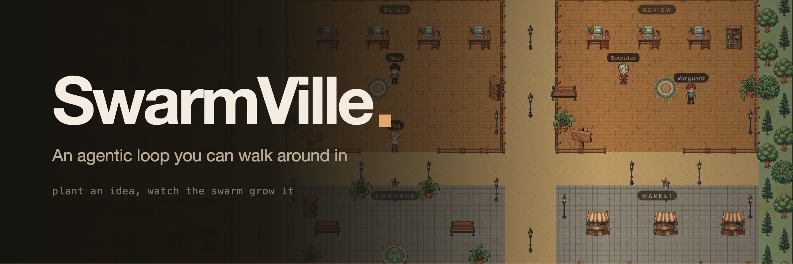

<div align="center">



Leave an agent working in a shared office. Drag it onto the floor, back other people's ideas, talk face to face.

[](LICENSE)
[](https://nodejs.org)
[](#providers)

English · [Español](README.es.md) · [中文](README.zh-CN.md)

</div>

---

## What it is

An agentic loop is a wall of text. SwarmVille renders it as an office you can walk
around, and turns it into something several people do together:

- **Leave an agent.** Type what you want, then pick your agent up and set it down
  anywhere on the floor. It stays there, working, while you do something else.
- **Back an idea.** Everyone's ideas wait in one line on the **Board**. Backing one
  moves it up, so the crowd decides what the swarm builds next.
- **Talk face to face.** Walk into the commons and your camera appears above your
  head, squircle bubble and all. Media is peer-to-peer.

No setup screen, no jargon: one field, one button, one gesture.

## Quick start

Node 22+.

```bash
npm install
npm run dev
```

Open <http://127.0.0.1:5173>. That starts Vite on 5173 and the relay on 8765; Vite
proxies `/api` and `/ws`, so the browser only ever talks to one origin.

No API key required. The default provider, `agy`, needs the Antigravity CLI;
without it the relay falls back to the offline `mock` simulator, which runs the
whole loop, revise cycle included, and hands back a real little web page.

Walk with **WASD** or tap the floor. **Esc** goes back to the wide shot.

## Leaving an agent

1. Write your idea in the bar at the bottom, or tap one of the suggestions.
2. Press **Leave my agent**, or grab the coloured agent at the left of the bar and
   drop it where you like. The glove cursor closes around it; a ring shows where it
   will land, and it drops in from above.
3. It stands there with three bouncing dots while the swarm works on it. Click it
   to find its card on the Board.

Dragging uses pointer events, not HTML drag-and-drop, so it works with a finger
too. Press **Esc** to put the agent back.

## The line

One swarm, many people, so ideas take turns. The relay keeps a single queue:

- the running idea is first, the rest are ordered by how many people back them,
  then by who arrived first;
- you cannot back your own idea, and backing twice takes it back;
- you can withdraw your own waiting ideas, and stop your own run;
- a person who leaves loses their waiting ideas and their votes. A run that is
  already going keeps going: leaving an agent and walking away is the point.

Limits are `QUEUE_MAX` (12 ideas in total) and `JOBS_PER_PEER` (2 each).

## What you get back

When a run finishes, the builder's deliverable opens in a card. If the objective
was something that runs in a browser, the builder hands over one self-contained
HTML page and you see it working in a sandboxed preview. **Publish link** writes
it to `.data/releases/` and copies an address the relay serves at `/r/<id>`;
**Download** gives you the file. Otherwise you get the plain-language summary.

Deliberately not Vercel or GitHub. A tool that binds to `127.0.0.1` and has no
authentication has no business holding a deploy token. The page is served under
`Content-Security-Policy: sandbox`, so it runs but cannot read this app's storage;
see [SECURITY.md](SECURITY.md).

## Little things that make it feel alive

- **Reactions.** Press **1** to **5** (or the smiley in the top bar) and 👋 👏 ❤️ 🔥 🎉
  float up from your head, for everyone to see.
- **Sound.** A soft thud when you set your agent down, a tick when you back an idea,
  a little chime when a run finishes. Synthesised on the spot, no audio files; off in
  Settings.
- **A streak.** Leave an idea on consecutive days and a flame appears in the top bar.
  It lives in your browser only: it is a nudge to come back, not an account.
- **The shelf.** Under the Board, the last things the swarm built, one click from
  their result. When somebody else's idea finishes you get a small nudge to look.
- **Life.** Agents with nothing to do stretch their legs; the tab title says what is
  happening while you are elsewhere and cheers when something finishes.

Everything that opens also leaves, with an animation, and the frame rate holds 60.

## Take it to Jean

[Jean](https://jean.build) is where the work on a real repository happens: worktrees,
sessions, your own CLI agents. It has no public API to call, so the bridge is the
honest one. In a result card, **Take to Jean** copies a brief (goal, plan, what was
built, the review) to paste into any Jean chat, and opens your Jean if you told
Settings its address. That address can carry a token, so it stays in your browser
and is never sent to the relay.

## Deploy

One process serves the app and the relay: `npm run build && npm start`, or Docker.
Set `ACCESS_CODE` and it becomes a private office; **Copy invitation link** in
Settings gives a link that walks people straight in. There is a one-click
Render blueprint too (`render.yaml`). See [DEPLOY.md](DEPLOY.md).

## The loop

```
plan ──▶ build ──▶ review ──┬── PASS ──▶ verify ──▶ archive
            ▲               │
            └─── REVISE ────┘   (bounded by MAX_REVISIONS)
```

Each phase is one model call by one agent, and the reviewer's verdict closes the
loop: `VERDICT: REVISE` sends control back to the builder.

| Agent | Phase | Room |
|---|---|---|
| Atlas | Plan | Plan |
| Neo | Build | Build |
| Socrates | Review | Review |
| Vanguard | Verify | Review |
| Alexandria | Archive | Memory |

Set `DECOMPOSE=1` and the builder takes the plan one numbered step at a time, one
model call each. It costs a call per step, which is why it is off by default.

Nothing on screen is invented. Every model call is a **step** with its latency,
tokens, attempt and full output, and where an agent stands and whether it is
thinking comes from those records, not from an animation that guesses.

## The archive

Alexandria writes one JSON line per finished run to `.data/archive.jsonl`: the
goal, her note, the outcome and what it cost. Click her to open the memory and
search it. JSONL because a line is the whole record, `tail -f` works on it, and a
corrupt line costs one run instead of the archive. Set `ARCHIVE_FILE` to move it.

## Providers

Pick one in the top bar, or set `PROVIDER` in `.env`.

| id | What it is | Needs |
|---|---|---|
| `agy` | Gemini 3.6 Flash through the Antigravity CLI. The default. | `agy` on the PATH |
| `agy-pro` | Gemini 2.5 Pro through the Antigravity CLI | `agy` on the PATH |
| `crosstalk` | The crosstalk bridge (`crosstalk.sh ask`) | `agy` on the PATH and `CROSSTALK_SCRIPT` |
| `claude` | Claude Code, headless (`claude -p`) | `claude` on the PATH |
| `ollama` | Local models over Ollama | Ollama running locally |
| `anthropic` | Claude via the Anthropic API | `ANTHROPIC_API_KEY` |
| `mock` | Offline simulator. The fallback. | nothing |

Keys are read by the relay from the environment and never reach the browser. If a
provider cannot be constructed the relay falls back to `mock` and marks the
selector, instead of failing silently.

## The art

The characters are generated with `gpt-image-2` and then reduced to a pixel grid.
The floors, walls and furniture are drawn in code (`src/world/sprites.ts`), so the
whole look of the office is a palette in `src/world/theme.ts`. `art/manifest.json` holds one prompt per asset, `tools/genart.mjs`
generates them, and `tools/pixelize.py` crops, downscales, hardens the alpha,
quantises to 64 colours and packs a single atlas. Character sheets are one image
of four poses, split on the empty columns between them.

```bash
export RELAY_URL=https://host/openai RELAY_KEY=…  # any OpenAI-compatible images API
npm run art                        # generate whatever is missing, then repack
python3 tools/pixelize.py --selftest
```

Only `public/art/atlas.png` and `atlas.json` are committed. The raw frames are
intermediates.

The renderer draws the world into an offscreen canvas at art resolution and blows
it up by a whole-number factor, so every pixel on screen is the same size and
nothing is ever half-interpolated. Labels are drawn afterwards at device
resolution, where legibility beats pixel purity.

## HTTP API

The relay is usable without the UI.

```bash
curl localhost:8765/api/health
curl localhost:8765/api/state
# 201 {run} when the swarm was idle, 202 {queued, job} when it joined the line
curl -X POST localhost:8765/api/runs \
  -H 'content-type: application/json' \
  -d '{"goal":"A landing page for my yoga class"}'
curl -X POST localhost:8765/api/runs/stop
curl 'localhost:8765/api/archive?q=yoga'
curl -X POST localhost:8765/api/releases -d '{"html":"<!doctype html><h1>hi</h1>"}'
```

The WebSocket at `/ws` pushes `snapshot`, `run`, `step`, `event`, `agent`,
`handoff`, `queue`, `provider`, presence and WebRTC signalling messages. It accepts
`run:start {goal, at?}`, `run:stop`, `queue:back {id}`, `queue:cancel {id}`,
`presence:name`, `presence:move`, `room:join`, `room:leave` and `rtc:signal`.
A run belongs to the connection that left it; only that connection can stop it.

## Layout

```
server/
  index.js          HTTP + WebSocket, security middleware
  queue.js          the shared line of ideas (pure, unit-tested)
  orchestrator.js   the agentic loop
  archive.js        one JSON line per finished run
  releases.js       publishes and serves a single-file release
  security.js       rate limits, origin checks, body caps, sanitising
  rooms.js          presence + WebRTC signalling
  providers/        agy, claude, crosstalk, ollama, anthropic, mock
src/
  world/
    World.ts        the 2D renderer and the drop target
    map.ts          the office layout
    sprites.ts      floors, walls and furniture, drawn in code
    theme.ts        palette, tile grid, room rects
    atlas.ts        character spritesheet loader
  ui/               the bar, the Board, the run pill, the result card, the call
  lib/              relay + call hooks, drag, i18n (es/en), WebRTC mesh
public/cursors/     the glove cursors
art/manifest.json   every character and its prompt
tools/              generate art, pack the atlas
```

## Scripts

```bash
npm run dev        # relay + web
npm run relay      # relay only
npm start          # the built app and the relay in one process
npm test           # the queue's rules
npm run typecheck  # tsc --noEmit
npm run build      # typecheck + production bundle
npm run art        # regenerate the spritesheet
```

## Security

Local-first by default: binds `127.0.0.1`, allowlists origins, and has **no
authentication**. Everyone who can reach the relay shares one swarm, one line and
one budget of model calls; ownership is per connection, not per account. Read
[SECURITY.md](SECURITY.md) before putting it on a network.

## License

MIT — see [LICENSE](LICENSE).
