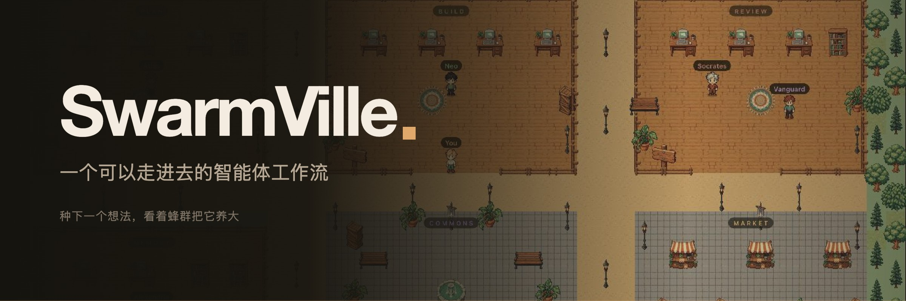

<div align="center">



五个智能体，五间工作室，一座小镇。工作流正在发生的时候就看得见，而不是事后翻日志。

[](LICENSE)
[](https://nodejs.org)
[](#模型提供方)

[English](README.md) · [Español](README.es.md) · 中文

</div>

---

## 问题在哪

一轮智能体工作流就是一面文字墙。规划、构建、评审、返工、验证——五次模型调用滚动的速度比你读的速度还快；等到它出错，你只能往回翻，猜是哪一步坏了。

信息从来不是问题，**形式**才是。一个日志窗口，用来表达五个角色、一次交接和一个循环，本来就不称职。

所以 SwarmVille 把这个循环画成了一个地方。Atlas 站在规划室的书桌前，脚下亮着一圈光：那是一次正在进行的模型调用。Neo 和 Socrates 之间划过一道弧线：那是交接。Socrates 又走回 Neo 那边：评审给了返工。你不是在读状态，你是在看状态。

## 快速开始

需要 Node 20+。

```bash
npm install
npm run dev
```

打开 <http://127.0.0.1:5173>。这会同时启动 5173 端口的 Vite 和 8765 端口的中继服务；Vite 会把 `/api` 和 `/ws` 代理过去，所以浏览器只和一个源通信。

不需要任何 API key。默认的 `mock` 提供方会完整离线跑完整个循环，包括返工，所以第一次启动小镇就是活的。

用 **WASD** 走路，或者直接点地面。在底部的输入框里写下一个目标，然后看五个智能体去完成它。

## 循环

```
plan ──▶ build ──▶ review ──┬── PASS ──▶ verify ──▶ archive
            ▲               │
            └─── REVISE ────┘   （由 MAX_REVISIONS 限制次数）
```

每个阶段都是某一个智能体的一次模型调用。真正闭合循环的是评审的结论：`VERDICT: REVISE` 会把控制权交回给构建者。

| 智能体 | 阶段 | 工作室 |
|---|---|---|
| Atlas | 规划 | Plan |
| Neo | 构建 | Build |
| Socrates | 评审 | Review |
| Vanguard | 验证 | Review |
| Alexandria | 归档 | Memory |

## 屏幕上没有一处是编造的

每次模型调用都会记录成一个**步骤**，每个步骤都带着真实耗时、输入与输出 token 数、第几次尝试、完整输出，以及失败时的原因。智能体站在哪里、脚下的光圈亮不亮，都是从这些记录推导出来的，不是一个靠猜的进度动画。

产品经验值和奖励属于花园的游戏状态。它们绝不会被包装成模型置信度，或者某个编造出来的质量分。

## 花园

包在智能体循环外面的那层可玩循环。种下一个产品，把它交给蜂群，地块就会随着真实步骤的产生，依次走过规划、设计、构建、评审、验证和交付。两次运行之间可以用能量照料它，在市集买肥料，完成村庄任务，最后收获成品换取金币、宝石和经验。

已交付的地块会打开 **产品工作室**：编辑生成的 HTML、CSS、JavaScript 或 README，发布修订版，在 iframe 里预览，或者下载一个可直接运行的单文件应用。个人档案和地块保存在浏览器本地存储里。

## 广场

走进广场就等于加入房间：中继服务会把已经在场的人告诉你，你的浏览器随即和每个人建立 WebRTC 连接。音视频是点对点的——中继只转发 SDP 和 ICE。

拒绝摄像头授权也没关系，你会以旁听者的身份加入。公共 STUN 足够覆盖同一台机器和同一个局域网；要穿越对称型 NAT 需要 TURN 服务器（见 `.env.example`）。

## 模型提供方

在顶栏里选，或者在 `.env` 里设置 `PROVIDER`。

| id | 是什么 | 需要 |
|---|---|---|
| `mock` | 离线模拟器，默认选项 | 无 |
| `ollama` | 通过 Ollama 跑本地模型 | 本地运行中的 Ollama |
| `anthropic` | 通过 Anthropic API 使用 Claude | `ANTHROPIC_API_KEY` |

密钥由中继服务从环境变量读取，永远不会到达浏览器。如果某个提供方无法初始化，中继会回退到 `mock` 并在选择器上做出标记，而不是悄悄失败。

## 美术

每一块地砖、每一件道具、每一个角色都由 `gpt-image-2` 生成，再压回像素网格。`art/manifest.json` 为每个素材保存一条提示词，`tools/genart.mjs` 负责生成，`tools/pixelize.py` 负责裁剪、缩小、硬化 alpha 通道、量化到 64 色，并打包成单张图集。角色表是一张包含四个朝向的图，靠姿势之间的空列切分。

```bash
npm run art                        # 补齐缺失的素材并重新打包
python3 tools/pixelize.py --selftest
```

仓库里只提交 `public/art/atlas.png` 和 `atlas.json`。那 29 MB 的原始帧只是中间产物；全部重新生成大约花费 1.40 美元。

渲染器先把世界画到一张按美术分辨率大小的离屏画布上，再按整数倍放大，所以屏幕上每个像素都一样大，不会出现半个插值出来的像素。文字标签是之后按设备分辨率绘制的——在那里，看得清比像素纯粹更重要。

## HTTP 接口

不用界面也能使用中继服务。

```bash
curl localhost:8765/api/health
curl localhost:8765/api/state
curl -X POST localhost:8765/api/runs \
  -H 'content-type: application/json' \
  -d '{"goal":"给公开的 REST API 加上限流"}'
curl -X POST localhost:8765/api/runs/stop
```

`/ws` 上的 WebSocket 会推送 `snapshot`、`run`、`step`、`event`、`agent`、`handoff`、`provider`，以及在线状态和 WebRTC 信令消息。

## 目录结构

```
server/
  index.js          HTTP + WebSocket，安全中间件
  orchestrator.js   智能体循环
  security.js       限流、来源校验、请求体上限、内容清洗
  rooms.js          在线状态 + WebRTC 信令
  providers/        mock、ollama、anthropic
src/
  world/
    World.ts        2D 渲染器
    map.ts          村庄布局
    theme.ts        调色板、地砖网格、房间矩形
    atlas.ts        图集加载器
  ui/               各类面板
  lib/              WebSocket 客户端、WebRTC 网状连接
art/manifest.json   每个精灵及其提示词
tools/              生成美术资源、打包图集
assets/             横幅与品牌资源
```

## 脚本

```bash
npm run dev        # 中继 + 前端
npm run relay      # 只启动中继
npm run typecheck  # tsc --noEmit
npm run build      # 类型检查 + 生产构建
npm run art        # 重新生成图集
```

## 安全

默认只在本地运行：绑定 `127.0.0.1`，按白名单校验来源，并且**没有任何鉴权**。把它放到网络上之前，请先读 [SECURITY.md](SECURITY.md)。

## 许可证

MIT —— 见 [LICENSE](LICENSE)。
