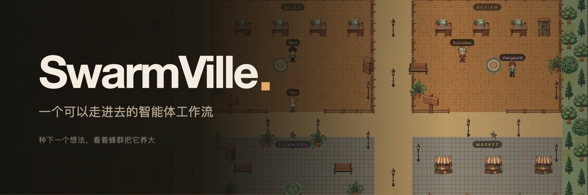

<div align="center">



在共享办公室里让智能体替你干活：把它拖到地板上，支持别人的点子，面对面聊天。

[](LICENSE)
[](https://nodejs.org)
[](#模型提供方)

[English](README.md) · [Español](README.es.md) · 中文

</div>

---

## 这是什么

智能体工作流是一面文字墙。SwarmVille 把它画成一间可以走动的办公室，并把它变成几个人
一起做的事：

- **留下一个智能体。** 写下你想要的东西，然后把你的智能体拎起来，放到地板上任意位置。
  你去做别的事，它留在那里继续工作。
- **支持一个点子。** 所有人的点子在**公告板**上排成一队。支持某个点子会让它往前排，
  于是由大家决定蜂群接下来做什么。
- **面对面聊天。** 走进公共区，你的摄像头会出现在头顶的圆角气泡里。视频是点对点传输的。

没有设置页面，没有术语：一个输入框，一个按钮，一个手势。

## 快速开始

需要 Node 22+。

```bash
npm install
npm run dev
```

打开 <http://127.0.0.1:5173>。这会在 5173 启动 Vite，在 8765 启动 relay；Vite 代理
`/api` 和 `/ws`，所以浏览器始终只和一个源通信。

不需要 API key。默认提供方 `agy` 需要 Antigravity CLI；没有它时 relay 会退回离线的
`mock` 模拟器，跑完整个循环（包含修改环节），并交出一个真实的小网页。

用 **WASD** 行走，或点击地板。按 **Esc** 回到全景。

## 留下一个智能体

1. 在底部输入栏写下你的点子，或点一个建议。
2. 点 **留下我的智能体**，或抓起输入栏左边那个彩色智能体，放到你想要的位置。手套光标会
   握住它；地上的圆环标出落点，它会从空中落下来。
3. 它站在那里，头顶三个跳动的小点，蜂群在处理它。点击它就能在公告板上找到对应的卡片。

拖拽使用指针事件而不是 HTML 拖放，所以手指也能用。按 **Esc** 把智能体放回去。

## 队列

一个蜂群，很多人，所以点子要轮流。relay 只维护一个队列：

- 正在运行的点子排第一，其余按支持人数排序，人数相同则先到先得；
- 不能支持自己的点子，重复支持等于取消；
- 可以撤回自己排队中的点子，也可以停止自己的运行；
- 离开的人会失去排队中的点子和他们投出的票。已经开始的运行会继续：
  留下智能体然后走开，正是这个设计的意义。

上限是 `QUEUE_MAX`（总共 12 个点子）和 `JOBS_PER_PEER`（每人 2 个）。

## 你会得到什么

运行结束后，构建者的交付物会在卡片中打开。如果目标是能在浏览器里运行的东西，构建者会交出
一个自包含的 HTML 页面，你可以在隔离的预览中看到它运行。**发布链接**会把它写入
`.data/releases/`，并复制 relay 在 `/r/<id>` 提供的地址；**下载**给你文件本身。否则你会
得到一段通俗的总结。

刻意不接 Vercel 或 GitHub：一个绑定在 `127.0.0.1`、没有认证的工具，不该持有部署令牌。页面
在 `Content-Security-Policy: sandbox` 下提供，能运行，但读不到本应用的存储；见
[SECURITY.md](SECURITY.md)。

## 让它有生命力的小细节

- **表情。** 按 **1** 到 **5**（或点顶栏的笑脸），👋 👏 ❤️ 🔥 🎉 会从你头顶飘起，所有人都看得到。
- **声音。** 放下智能体时一声轻响，支持点子时一声滴答，运行结束时一段小小的和弦。
  现场合成，没有音频文件；可在设置里关闭。
- **连续天数。** 连续几天留下点子，顶栏会出现一团火苗。它只存在你的浏览器里：
  是提醒你回来的小推动，不是账号。
- **展示架。** 公告板下面是蜂群最近做完的东西，点一下就能看结果。别人的点子完成时，
  你会收到一个低调的提示。
- **生气。** 没事做的智能体会溜达几步；标签页标题会告诉你正在发生什么，完成时还会庆祝。

所有打开的东西也会带着动画离开，帧率稳定在 60。

## 带去 Jean

[Jean](https://jean.build) 是在真实仓库里干活的地方：worktree、会话、你自己的命令行智能体。
它没有可调用的公开 API，所以桥接方式很老实：在结果卡上点**带去 Jean**，会复制一份简报
（目标、计划、已构建的内容、评审）供你粘贴到任意 Jean 对话，如果你在设置里填了 Jean 的
地址，还会打开它。该地址可能带令牌，所以只保存在你的浏览器里，不会发给 relay。

## 部署

一个进程同时提供应用和 relay：`npm run build && npm start`，或用 Docker。设置
`ACCESS_CODE` 就成了私人办公室；设置里的**复制邀请链接**会给出一个直接进入的链接。
见 [DEPLOY.md](DEPLOY.md)。

## 循环

```
plan ──▶ build ──▶ review ──┬── PASS ──▶ verify ──▶ archive
            ▲               │
            └─── REVISE ────┘   （受 MAX_REVISIONS 限制）
```

每个阶段是一个智能体的一次模型调用，评审的结论收尾：`VERDICT: REVISE` 会把控制权交回构建者。

| 智能体 | 阶段 | 房间 |
|---|---|---|
| Atlas | Plan | Plan |
| Neo | Build | Build |
| Socrates | Review | Review |
| Vanguard | Verify | Review |
| Alexandria | Archive | Memory |

设置 `DECOMPOSE=1` 后，构建者按编号一步一步处理计划，每步一次模型调用。每步多一次调用，
所以默认关闭。

屏幕上没有一处是编造的。每次模型调用都是一个**步骤**，带有延迟、token、尝试次数和完整输出；
智能体站在哪里、是否在思考，都来自这些记录，而不是靠猜的动画。

## 归档

Alexandria 每完成一次运行就往 `.data/archive.jsonl` 写一行 JSON：目标、她的笔记、结果和成本。
点击她即可打开记忆并搜索。用 JSONL 是因为一行就是完整记录，`tail -f` 可用，一行损坏只损失
一次运行而不是整个归档。`ARCHIVE_FILE` 可以改位置。

## 模型提供方

在顶栏里选，或者在 `.env` 里设置 `PROVIDER`。

| id | 是什么 | 需要 |
|---|---|---|
| `agy` | 通过 Antigravity CLI 使用 Gemini 3.6 Flash，默认选项 | PATH 上有 `agy` |
| `agy-pro` | 通过 Antigravity CLI 使用 Gemini 2.5 Pro | PATH 上有 `agy` |
| `crosstalk` | crosstalk 桥接（`crosstalk.sh ask`） | PATH 上有 `agy`，并设置 `CROSSTALK_SCRIPT` |
| `claude` | 无界面模式的 Claude Code（`claude -p`） | PATH 上有 `claude` |
| `ollama` | 通过 Ollama 跑本地模型 | 本地运行中的 Ollama |
| `anthropic` | 通过 Anthropic API 使用 Claude | `ANTHROPIC_API_KEY` |
| `mock` | 离线模拟器，回退选项 | 无 |

密钥由中继服务从环境变量读取，永远不会到达浏览器。如果某个提供方无法初始化，中继会回退到 `mock` 并在选择器上做出标记，而不是悄悄失败。

## 美术

每一块地砖、每一件道具、每一个角色都由 `gpt-image-2` 生成，再压回像素网格。`art/manifest.json` 为每个素材保存一条提示词，`tools/genart.mjs` 负责生成，`tools/pixelize.py` 负责裁剪、缩小、硬化 alpha 通道、量化到 64 色，并打包成单张图集。角色表是一张包含四个朝向的图，靠姿势之间的空列切分。

```bash
export RELAY_URL=https://host/openai RELAY_KEY=…  # 任意兼容 OpenAI 的图像 API
npm run art                        # 补齐缺失的素材并重新打包
python3 tools/pixelize.py --selftest
```

仓库里只提交 `public/art/atlas.png` 和 `atlas.json`。那 29 MB 的原始帧只是中间产物；全部重新生成大约花费 1.40 美元。

渲染器先把世界画到一张按美术分辨率大小的离屏画布上，再按整数倍放大，所以屏幕上每个像素都一样大，不会出现半个插值出来的像素。文字标签是之后按设备分辨率绘制的——在那里，看得清比像素纯粹更重要。

## HTTP 接口

不用界面也能使用 relay。

```bash
curl localhost:8765/api/health
curl localhost:8765/api/state
# 蜂群空闲时返回 201 {run}，进入队列时返回 202 {queued, job}
curl -X POST localhost:8765/api/runs \
  -H 'content-type: application/json' \
  -d '{"goal":"给我的瑜伽课做一个落地页"}'
curl -X POST localhost:8765/api/runs/stop
curl 'localhost:8765/api/archive?q=yoga'
curl -X POST localhost:8765/api/releases -d '{"html":"<!doctype html><h1>hi</h1>"}'
```

`/ws` 上的 WebSocket 会推送 `snapshot`、`run`、`step`、`event`、`agent`、`handoff`、`queue`、
`provider`、在线状态和 WebRTC 信令。它接受 `run:start {goal, at?}`、`run:stop`、
`queue:back {id}`、`queue:cancel {id}`、`presence:name`、`presence:move`、`room:join`、
`room:leave` 和 `rtc:signal`。一次运行属于留下它的那个连接，只有该连接能停止它。

## 目录结构

```
server/
  index.js          HTTP + WebSocket、安全中间件
  queue.js          共享的点子队列（纯逻辑，有单元测试）
  orchestrator.js   智能体循环
  archive.js        每次完成的运行写一行 JSON
  releases.js       发布并提供单文件交付物
  security.js       限流、来源校验、请求体上限、清洗
  rooms.js          在线状态 + WebRTC 信令
  providers/        agy、claude、crosstalk、ollama、anthropic、mock
src/
  world/
    World.ts        2D 渲染与放置目标
    map.ts          办公室布局
    sprites.ts      地板、墙和家具，用代码绘制
    theme.ts        调色板、格子、房间矩形
    atlas.ts        角色精灵图加载
  ui/               输入栏、公告板、进度条、结果卡、通话
  lib/              relay 与通话 hooks、拖拽、i18n（es/en）、WebRTC 网格
public/cursors/     手套光标
art/manifest.json   每个角色及其提示词
tools/              生成美术、打包图集
```

## 脚本

```bash
npm run dev        # relay + 网页
npm run relay      # 只启动 relay
npm start          # 已构建的应用和 relay 合为一个进程
npm test           # 队列的规则
npm run typecheck  # tsc --noEmit
npm run build      # 类型检查 + 生产构建
npm run art        # 重新生成精灵图
```

## 安全

默认本地优先：绑定 `127.0.0.1`，限制来源，并且**没有认证**。能访问 relay 的所有人共享同一个
蜂群、同一个队列和同一份模型调用预算；归属按连接而不是按账号。放到网络上之前请先读
[SECURITY.md](SECURITY.md)。

## 许可证

MIT — 见 [LICENSE](LICENSE)。
