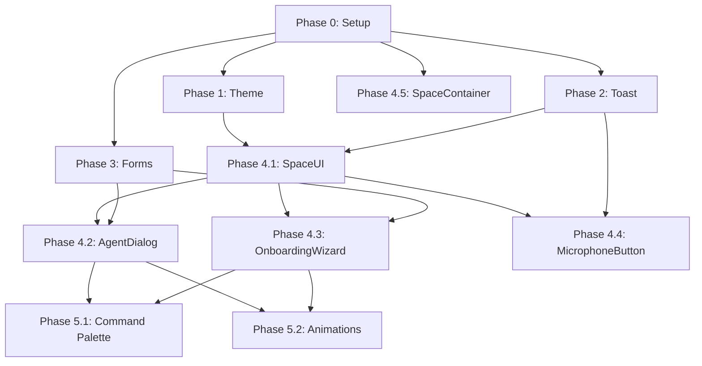

# SwarmVille shadcn/ui Refactorization Plan

**Document Version:** 1.0
**Date:** 2025-11-09
**Type:** UI/UX Enhancement + Design System Implementation
**Scope:** Complete shadcn/ui integration across application
**Status:** Planning Phase

---

## Executive Summary

This refactorization plan outlines a comprehensive upgrade of SwarmVille's UI layer using shadcn/ui components. The application currently has a basic shadcn/ui setup with 9 components but lacks consistency, advanced features like dark mode, proper form validation, and modern microinteractions.

### Current State
- **Framework:** React 18 + TypeScript + Vite + Tailwind CSS
- **Rendering:** PixiJS for 2D spatial canvas
- **UI Components:** 9 basic shadcn/ui components (button, card, dialog, input, label, select, textarea, badge, alert)
- **State Management:** Zustand + Jotai
- **Styling:** Tailwind CSS with basic color system (no dark mode)
- **Forms:** No validation framework
- **Notifications:** None

### Target State
- **Complete shadcn/ui component library** (20+ components)
- **Dark/light mode** with system preference detection
- **Form validation** using react-hook-form + zod
- **Toast notifications** for user feedback
- **Enhanced microinteractions** and animations
- **Accessible** and keyboard-friendly UI
- **Consistent design system** with proper theming

### Key Metrics
- **Components to Refactor:** 8 major components
- **New Components to Install:** 15+ shadcn/ui components
- **Estimated Impact:** High (complete UI transformation)
- **Risk Level:** Medium (breaking changes in UI layer only)
- **Development Time:** 5-7 days (phased implementation)

---

## Current State Analysis

### Existing Components Audit

#### 1. App.tsx
**Current Implementation:**
- Simple loading state with custom spinner
- No error boundaries
- Basic button for space creation
- Uses OnboardingWizard component

**Issues Identified:**
- No skeleton loaders
- No proper error state UI
- Missing toast notifications for feedback
- No loading progress indication

**shadcn/ui Components Used:**
- Button ✅
- None for loading states ❌

---

#### 2. SpaceContainer.tsx
**Current Implementation:**
- Pure PixiJS canvas rendering container
- Custom loading/error states in JSX
- 1,364 lines (very complex component)

**Issues Identified:**
- Inline error/loading UI instead of reusable components
- No skeleton loaders
- Hardcoded styles for loading spinner
- No toast notifications for errors

**shadcn/ui Components Used:**
- None currently ❌

**Improvement Opportunities:**
- Add Skeleton for loading states
- Use Alert for errors
- Implement toast for runtime errors
- Extract UI overlays to separate components

---

#### 3. SpaceUI.tsx
**Current Implementation:**
- Top bar with space name + action buttons
- Agent sidebar with custom cards
- Minimap with SVG
- Keyboard hints overlay
- Modal dialogs for AgentSpawner, AgentDialog, SpriteGenerator

**Issues Identified:**
- Hardcoded styles for keyboard hints (should be Badge/Tooltip)
- Agent cards use custom styling (should use shadcn Card)
- Top bar could use Toolbar/Header component
- Missing hover states and smooth transitions
- No empty state illustration
- Sidebar scrollbar not styled

**shadcn/ui Components Used:**
- Button ✅
- Card ✅ (basic usage)

**Improvement Opportunities:**
- Add Tooltip for keyboard hints
- Use Badge for status indicators
- Implement ScrollArea for sidebar
- Add HoverCard for agent previews
- Use Separator for visual breaks
- Add Avatar component for agents
- Implement Command palette for quick actions

---

#### 4. AgentDialog.tsx
**Current Implementation:**
- Chat interface with messages
- Input field + send button
- Loading state with spinner
- Error alerts
- Custom dialog implementation

**Issues Identified:**
- Dialog implementation is custom (should use shadcn Dialog primitives)
- No scroll-to-bottom animation
- Messages lack proper avatars
- No message timestamps formatting
- No typing indicators
- Input lacks character count
- No message actions (copy, delete)

**shadcn/ui Components Used:**
- Dialog ✅ (custom implementation)
- Button ✅
- Input ✅
- Alert ✅

**Improvement Opportunities:**
- Refactor to use shadcn Dialog with proper primitives
- Add Avatar for user/agent
- Use ScrollArea for messages
- Implement Tooltip for timestamps
- Add DropdownMenu for message actions
- Use Badge for agent status
- Add Skeleton for loading messages

---

#### 5. AgentSpawner.tsx
**Current Implementation:**
- Form with name, role selector, model selector
- Grid of role buttons with emojis
- Custom dialog wrapper
- Loading state

**Issues Identified:**
- No form validation
- Input fields use native HTML styles
- Role selector uses custom grid (could be RadioGroup)
- No error feedback on submit
- Select dropdown not styled properly
- Missing field descriptions/helpers
- No character limit on name input

**shadcn/ui Components Used:**
- Dialog ✅
- Button ✅
- None for form validation ❌

**Improvement Opportunities:**
- Implement react-hook-form + zod validation
- Use Form components from shadcn
- Replace custom role grid with RadioGroup or ToggleGroup
- Add FormField with FormLabel, FormControl, FormDescription, FormMessage
- Use Select component properly
- Add toast notifications for success/errors
- Implement field-level validation feedback

---

#### 6. OnboardingWizard.tsx
**Current Implementation:**
- Single screen with logo, title, button
- Backdrop blur overlay
- Simple card layout

**Issues Identified:**
- No multi-step wizard flow
- No progress indicator
- No skip option
- Missing feature highlights
- No user preference collection

**shadcn/ui Components Used:**
- Card ✅
- Button ✅

**Improvement Opportunities:**
- Multi-step wizard with Steps/Progress component
- Add Carousel for feature showcase
- Use Checkbox for preferences
- Implement form for user settings
- Add animations with framer-motion
- Use Accordion for FAQ/help section

---

#### 7. MicrophoneButton.tsx
**Current Implementation:**
- Floating action button
- Recording state with pulse animation
- Transcript display in card
- Error alert

**Issues Identified:**
- Transcript card appears/disappears abruptly
- No recording timer
- Missing waveform visualization
- Alert for errors is not a toast

**shadcn/ui Components Used:**
- Button ✅
- Card ✅
- Alert ✅

**Improvement Opportunities:**
- Replace Alert with Toast for errors
- Add Popover for transcript preview
- Implement Progress for recording duration
- Add HoverCard for help/shortcuts
- Use Badge for recording status
- Smooth animations with framer-motion

---

#### 8. SpriteGeneratorDialog.tsx
**Current Implementation:**
- (Not read yet, but based on usage in SpaceUI)
- Dialog for AI sprite generation
- Form inputs for sprite customization

**Assumed Issues:**
- No form validation
- Missing loading states
- No progress feedback
- No preview component

**Improvement Opportunities:**
- Implement react-hook-form + zod
- Add Progress for generation status
- Use Tabs for different generation modes
- Implement AspectRatio for sprite preview
- Add Slider for customization options
- Use Accordion for advanced settings

---

### Existing shadcn/ui Components Inventory

**Currently Installed (9 components):**

1. **alert.tsx** - Basic alert component ✅
2. **badge.tsx** - Badge component ✅
3. **button.tsx** - Button with variants ✅
4. **card.tsx** - Card with header/content/footer ✅
5. **dialog.tsx** - Custom dialog implementation ⚠️ (needs refactor to use Radix primitives)
6. **input.tsx** - Basic input field ✅
7. **label.tsx** - Form label ✅
8. **select.tsx** - Select dropdown ⚠️ (not using Radix primitives)
9. **textarea.tsx** - Textarea field ✅

**Status Assessment:**
- ✅ **Well implemented:** alert, badge, button, card, input, label, textarea (7 components)
- ⚠️ **Need refactoring:** dialog, select (2 components) - should use Radix UI primitives
- ❌ **Missing critical components:** ~15 components needed

---

### Color System & Theming Analysis

**Current Theme (index.css):**

```css
:root {
  --background: 0 0% 100%;     /* White */
  --foreground: 0 0% 3.6%;     /* Near black */
  --primary: 0 0% 9%;          /* Dark gray */
  --accent: 0 0% 9.8%;         /* Gray */
  /* ... etc */
}

.dark {
  --background: 0 0% 3.6%;     /* Dark gray */
  --foreground: 0 0% 98.2%;    /* Near white */
  /* ... etc */
}
```

**Issues:**
- ✅ Dark mode CSS variables defined
- ❌ No dark mode toggle implemented
- ❌ No system preference detection
- ❌ Colors are neutral (no brand identity)
- ❌ Missing semantic colors (info, warning, success)

**Improvements Needed:**
1. Implement next-themes for dark mode management
2. Add ThemeProvider wrapper
3. Create theme toggle button
4. Add brand colors (keep current neutral as option)
5. Implement semantic color variants

---

### Form Validation & Data Management

**Current State:**
- ❌ No form validation library
- ❌ Using basic `useState` for form state
- ❌ No schema validation
- ❌ Error handling is manual
- ❌ No form field-level feedback

**Dependencies Missing:**
```json
{
  "react-hook-form": "^7.x",
  "zod": "^3.x",
  "@hookform/resolvers": "^3.x"
}
```

**Impact:**
- AgentSpawner has no validation
- OnboardingWizard has no validation
- Potential for invalid data submission
- Poor user experience with errors

---

### User Feedback & Notifications

**Current State:**
- ❌ No toast notification system
- Using Alert component for inline errors (not dismissible)
- No success confirmations
- No loading progress notifications

**Missing Component:**
- Sonner (recommended toast library for shadcn/ui)

**Impact:**
- Users don't receive feedback for actions
- Error states are not clearly communicated
- No confirmation for destructive actions

---

## Identified Issues by Category

### 🔴 Critical (Must Fix)

1. **No Dark Mode Implementation**
   - CSS variables exist but no toggle/provider
   - Severity: High - Modern apps require dark mode

2. **No Form Validation**
   - AgentSpawner, OnboardingWizard lack validation
   - Severity: High - Data integrity risk

3. **No Toast Notifications**
   - Users don't receive action feedback
   - Severity: High - UX issue

4. **Dialog/Select Use Custom Implementation**
   - Not using Radix UI primitives (accessibility issues)
   - Severity: High - Accessibility compliance

### 🟡 Major (Should Fix)

5. **Inconsistent Component Usage**
   - Mix of shadcn + custom components
   - Severity: Medium - Maintainability

6. **Missing Loading States**
   - No skeleton loaders
   - Severity: Medium - UX polish

7. **No Avatar Component**
   - Agent representations are basic
   - Severity: Medium - Visual identity

8. **Hardcoded Styles**
   - Many inline Tailwind classes should be components
   - Severity: Medium - Maintainability

### 🟢 Minor (Nice to Have)

9. **No Microinteractions**
   - Missing hover effects, transitions
   - Severity: Low - Polish

10. **No Command Palette**
    - Power users would benefit
    - Severity: Low - Advanced feature

11. **No Data Tables**
    - If showing agent stats/logs
    - Severity: Low - Future feature

---

## Proposed Refactoring Plan

### Phase 0: Setup & Dependencies

**Goal:** Install required dependencies and set up infrastructure

**Tasks:**
1. Install shadcn/ui components via CLI
2. Install form libraries (react-hook-form, zod)
3. Install next-themes for dark mode
4. Install sonner for toasts
5. Update tsconfig paths if needed

**New Dependencies:**
```json
{
  "dependencies": {
    "@radix-ui/react-dialog": "^1.0.5",
    "@radix-ui/react-select": "^2.0.0",
    "@radix-ui/react-toast": "^1.1.5",
    "@radix-ui/react-avatar": "^1.0.4",
    "@radix-ui/react-scroll-area": "^1.0.5",
    "@radix-ui/react-tooltip": "^1.0.7",
    "@radix-ui/react-hover-card": "^1.0.7",
    "@radix-ui/react-separator": "^1.0.3",
    "@radix-ui/react-toggle-group": "^1.0.4",
    "@radix-ui/react-progress": "^1.0.3",
    "@radix-ui/react-popover": "^1.0.7",
    "@radix-ui/react-dropdown-menu": "^2.0.6",
    "@radix-ui/react-accordion": "^1.1.2",
    "@radix-ui/react-tabs": "^1.0.4",
    "@radix-ui/react-slider": "^1.1.2",
    "react-hook-form": "^7.50.0",
    "zod": "^3.22.4",
    "@hookform/resolvers": "^3.3.4",
    "next-themes": "^0.2.1",
    "sonner": "^1.3.1",
    "framer-motion": "^11.0.0"
  }
}
```

**shadcn/ui Components to Install:**
```bash
# Core components
npx shadcn-ui@latest add skeleton
npx shadcn-ui@latest add toast
npx shadcn-ui@latest add avatar
npx shadcn-ui@latest add scroll-area
npx shadcn-ui@latest add tooltip
npx shadcn-ui@latest add hover-card
npx shadcn-ui@latest add separator
npx shadcn-ui@latest add toggle-group
npx shadcn-ui@latest add progress
npx shadcn-ui@latest add popover
npx shadcn-ui@latest add dropdown-menu
npx shadcn-ui@latest add form
npx shadcn-ui@latest add radio-group

# Advanced components (if needed)
npx shadcn-ui@latest add accordion
npx shadcn-ui@latest add tabs
npx shadcn-ui@latest add slider
npx shadcn-ui@latest add command
npx shadcn-ui@latest add carousel
npx shadcn-ui@latest add aspect-ratio

# Refactor existing
npx shadcn-ui@latest add dialog --overwrite
npx shadcn-ui@latest add select --overwrite
```

**Duration:** 1 day
**Risk:** Low
**Dependencies:** None

---

### Phase 1: Theme System & Dark Mode

**Goal:** Implement dark mode with proper theming infrastructure

**Files to Create:**
1. `/src/components/theme/ThemeProvider.tsx` - next-themes wrapper
2. `/src/components/theme/ThemeToggle.tsx` - Dark mode toggle button
3. `/src/lib/theme.ts` - Theme utilities and constants

**Files to Modify:**
1. `/src/main.tsx` - Wrap app with ThemeProvider
2. `/src/index.css` - Enhance color palette with brand colors
3. `/src/components/space/SpaceUI.tsx` - Add theme toggle to top bar

**Implementation Details:**

**1. ThemeProvider.tsx**
```typescript
import { ThemeProvider as NextThemesProvider } from "next-themes"

export function ThemeProvider({ children }: { children: React.ReactNode }) {
  return (
    <NextThemesProvider
      attribute="class"
      defaultTheme="system"
      enableSystem
      disableTransitionOnChange
    >
      {children}
    </NextThemesProvider>
  )
}
```

**2. ThemeToggle.tsx**
```typescript
import { Moon, Sun } from "lucide-react"
import { useTheme } from "next-themes"
import { Button } from "@/components/ui/button"
import {
  DropdownMenu,
  DropdownMenuContent,
  DropdownMenuItem,
  DropdownMenuTrigger,
} from "@/components/ui/dropdown-menu"

export function ThemeToggle() {
  const { setTheme } = useTheme()

  return (
    <DropdownMenu>
      <DropdownMenuTrigger asChild>
        <Button variant="outline" size="icon">
          <Sun className="h-[1.2rem] w-[1.2rem] rotate-0 scale-100 transition-all dark:-rotate-90 dark:scale-0" />
          <Moon className="absolute h-[1.2rem] w-[1.2rem] rotate-90 scale-0 transition-all dark:rotate-0 dark:scale-100" />
          <span className="sr-only">Toggle theme</span>
        </Button>
      </DropdownMenuTrigger>
      <DropdownMenuContent align="end">
        <DropdownMenuItem onClick={() => setTheme("light")}>
          Light
        </DropdownMenuItem>
        <DropdownMenuItem onClick={() => setTheme("dark")}>
          Dark
        </DropdownMenuItem>
        <DropdownMenuItem onClick={() => setTheme("system")}>
          System
        </DropdownMenuItem>
      </DropdownMenuContent>
    </DropdownMenu>
  )
}
```

**3. Enhanced Color Palette (index.css)**
```css
@layer base {
  :root {
    --background: 0 0% 100%;
    --foreground: 222.2 84% 4.9%;

    --card: 0 0% 100%;
    --card-foreground: 222.2 84% 4.9%;

    --popover: 0 0% 100%;
    --popover-foreground: 222.2 84% 4.9%;

    --primary: 221.2 83.2% 53.3%;  /* Brand blue */
    --primary-foreground: 210 40% 98%;

    --secondary: 210 40% 96.1%;
    --secondary-foreground: 222.2 47.4% 11.2%;

    --muted: 210 40% 96.1%;
    --muted-foreground: 215.4 16.3% 46.9%;

    --accent: 210 40% 96.1%;
    --accent-foreground: 222.2 47.4% 11.2%;

    --destructive: 0 84.2% 60.2%;
    --destructive-foreground: 210 40% 98%;

    --success: 142.1 76.2% 36.3%;  /* New */
    --success-foreground: 355.7 100% 97.3%;  /* New */

    --warning: 45.4 93.4% 47.5%;  /* New */
    --warning-foreground: 26 83.3% 14.1%;  /* New */

    --info: 199.5 89.1% 48.4%;  /* New */
    --info-foreground: 210 40% 98%;  /* New */

    --border: 214.3 31.8% 91.4%;
    --input: 214.3 31.8% 91.4%;
    --ring: 221.2 83.2% 53.3%;

    --radius: 0.5rem;
  }

  .dark {
    --background: 222.2 84% 4.9%;
    --foreground: 210 40% 98%;

    --card: 222.2 84% 4.9%;
    --card-foreground: 210 40% 98%;

    --popover: 222.2 84% 4.9%;
    --popover-foreground: 210 40% 98%;

    --primary: 217.2 91.2% 59.8%;
    --primary-foreground: 222.2 47.4% 11.2%;

    --secondary: 217.2 32.6% 17.5%;
    --secondary-foreground: 210 40% 98%;

    --muted: 217.2 32.6% 17.5%;
    --muted-foreground: 215 20.2% 65.1%;

    --accent: 217.2 32.6% 17.5%;
    --accent-foreground: 210 40% 98%;

    --destructive: 0 62.8% 30.6%;
    --destructive-foreground: 210 40% 98%;

    --success: 142.1 70.6% 45.3%;
    --success-foreground: 144.9 80.4% 10%;

    --warning: 45.4 93.4% 47.5%;
    --warning-foreground: 26 83.3% 14.1%;

    --info: 199.5 89.1% 48.4%;
    --info-foreground: 210 40% 98%;

    --border: 217.2 32.6% 17.5%;
    --input: 217.2 32.6% 17.5%;
    --ring: 224.3 76.3% 48%;
  }
}
```

**Tests:**
- Toggle between light/dark/system themes
- Verify all components respect theme
- Test system preference detection
- Check persistence (localStorage)

**Duration:** 1 day
**Risk:** Low
**Dependencies:** Phase 0

---

### Phase 2: Toast Notification System

**Goal:** Replace inline alerts with toast notifications

**Files to Create:**
1. `/src/components/ui/sonner.tsx` - Sonner wrapper component
2. `/src/lib/toast.ts` - Toast utilities and helpers

**Files to Modify:**
1. `/src/main.tsx` - Add Toaster component
2. `/src/components/agents/AgentDialog.tsx` - Replace Alert with toast
3. `/src/components/agents/AgentSpawner.tsx` - Add success/error toasts
4. `/src/components/speech/MicrophoneButton.tsx` - Replace Alert with toast
5. `/src/App.tsx` - Add toast for initialization errors

**Implementation:**

**1. sonner.tsx**
```typescript
import { Toaster as Sonner } from "sonner"
import { useTheme } from "next-themes"

export function Toaster() {
  const { theme } = useTheme()

  return (
    <Sonner
      theme={theme as "light" | "dark" | "system"}
      position="top-right"
      richColors
      closeButton
      expand={true}
      toastOptions={{
        duration: 4000,
        className: "!rounded-lg !shadow-lg",
      }}
    />
  )
}
```

**2. Toast Utilities (toast.ts)**
```typescript
import { toast as sonnerToast } from "sonner"

export const toast = {
  success: (message: string, description?: string) => {
    sonnerToast.success(message, { description })
  },
  error: (message: string, description?: string) => {
    sonnerToast.error(message, { description })
  },
  info: (message: string, description?: string) => {
    sonnerToast.info(message, { description })
  },
  warning: (message: string, description?: string) => {
    sonnerToast.warning(message, { description })
  },
  loading: (message: string) => {
    return sonnerToast.loading(message)
  },
  promise: <T,>(
    promise: Promise<T>,
    { loading, success, error }: {
      loading: string
      success: string
      error: string
    }
  ) => {
    return sonnerToast.promise(promise, { loading, success, error })
  },
}
```

**3. Replace Alert in AgentDialog.tsx**
```typescript
// Before
<Alert variant="destructive" className="mb-4">
  {error}
</Alert>

// After (in error handler)
toast.error("Failed to send message", error)
```

**4. Add Success Toast in AgentSpawner.tsx**
```typescript
// After successful agent creation
toast.success("Agent created!", `${name} is ready to work`)
```

**Tests:**
- Test all toast variants (success, error, info, warning)
- Test toast positioning and stacking
- Test dark/light theme integration
- Test dismissibility

**Duration:** 1 day
**Risk:** Low
**Dependencies:** Phase 1

---

### Phase 3: Form Validation System

**Goal:** Implement react-hook-form + zod for all forms

**Files to Create:**
1. `/src/lib/validations/agent.ts` - Agent form schemas
2. `/src/lib/validations/onboarding.ts` - Onboarding schemas

**Files to Modify:**
1. `/src/components/agents/AgentSpawner.tsx` - Full refactor with validation
2. `/src/components/onboarding/OnboardingWizard.tsx` - Add multi-step form

**Implementation:**

**1. Agent Validation Schema (agent.ts)**
```typescript
import { z } from "zod"

export const agentSpawnerSchema = z.object({
  name: z
    .string()
    .min(2, "Name must be at least 2 characters")
    .max(30, "Name must be less than 30 characters")
    .regex(/^[a-zA-Z0-9 _-]+$/, "Name can only contain letters, numbers, spaces, hyphens, and underscores"),
  role: z.enum(["researcher", "coder", "designer", "pm", "qa", "devops", "custom"]),
  model: z.string().min(1, "Please select a model"),
  customRole: z.string().optional(),
})

export type AgentSpawnerFormData = z.infer<typeof agentSpawnerSchema>
```

**2. Refactored AgentSpawner.tsx**
```typescript
import { useForm } from "react-hook-form"
import { zodResolver } from "@hookform/resolvers/zod"
import { agentSpawnerSchema, type AgentSpawnerFormData } from "@/lib/validations/agent"
import {
  Form,
  FormControl,
  FormDescription,
  FormField,
  FormItem,
  FormLabel,
  FormMessage,
} from "@/components/ui/form"
import { toast } from "@/lib/toast"

export default function AgentSpawner({ spaceId, spriteId, onClose }: AgentSpawnerProps) {
  const { addAgent } = useSpaceStore()
  const { detectedCLIs } = useUserStore()

  const form = useForm<AgentSpawnerFormData>({
    resolver: zodResolver(agentSpawnerSchema),
    defaultValues: {
      name: "",
      role: "coder",
      model: detectedCLIs[0] || "gemini",
    },
  })

  async function onSubmit(data: AgentSpawnerFormData) {
    try {
      const finalSpriteId = spriteId ?? Math.floor(Math.random() * 50) + 1

      const agent: Agent = {
        id: crypto.randomUUID(),
        name: data.name,
        spaceId,
        ownerId: "user1",
        createdAt: Date.now(),
        position: { x: 25, y: 25 },
        role: data.role,
        model: {
          provider: data.model as "claude" | "gemini" | "openai",
          modelName: "auto",
          useUserCLI: true,
        },
        avatar: {
          icon: "●",
          color: ROLE_COLORS[data.role],
          emoji: getRoleEmoji(data.role),
          spriteId: finalSpriteId,
        },
        state: "idle",
      }

      addAgent(agent)
      toast.success("Agent created!", `${data.name} is ready to work`)
      onClose()
    } catch (error) {
      toast.error("Failed to create agent", error instanceof Error ? error.message : "Unknown error")
    }
  }

  return (
    <Dialog open={true} onClose={onClose}>
      {/* ... header ... */}

      <Form {...form}>
        <form onSubmit={form.handleSubmit(onSubmit)} className="space-y-4">
          <FormField
            control={form.control}
            name="name"
            render={({ field }) => (
              <FormItem>
                <FormLabel>Agent Name</FormLabel>
                <FormControl>
                  <Input placeholder="My Agent" {...field} />
                </FormControl>
                <FormDescription>
                  Choose a unique name for your agent (2-30 characters)
                </FormDescription>
                <FormMessage />
              </FormItem>
            )}
          />

          <FormField
            control={form.control}
            name="role"
            render={({ field }) => (
              <FormItem className="space-y-3">
                <FormLabel>Agent Role</FormLabel>
                <FormControl>
                  <ToggleGroup
                    type="single"
                    value={field.value}
                    onValueChange={field.onChange}
                    className="grid grid-cols-3 gap-2"
                  >
                    {AGENT_ROLES.map((role) => (
                      <ToggleGroupItem
                        key={role}
                        value={role}
                        aria-label={role}
                        className="flex flex-col items-center gap-1 p-3"
                      >
                        <span className="text-2xl">{getRoleEmoji(role)}</span>
                        <span className="text-xs capitalize">{role}</span>
                      </ToggleGroupItem>
                    ))}
                  </ToggleGroup>
                </FormControl>
                <FormMessage />
              </FormItem>
            )}
          />

          <FormField
            control={form.control}
            name="model"
            render={({ field }) => (
              <FormItem>
                <FormLabel>AI Model</FormLabel>
                <Select onValueChange={field.onChange} defaultValue={field.value}>
                  <FormControl>
                    <SelectTrigger>
                      <SelectValue placeholder="Select a model" />
                    </SelectTrigger>
                  </FormControl>
                  <SelectContent>
                    {detectedCLIs.map((cli) => (
                      <SelectItem key={cli} value={cli}>
                        {getCliDisplayName(cli)}
                      </SelectItem>
                    ))}
                  </SelectContent>
                </Select>
                <FormDescription>
                  Choose which AI model this agent will use
                </FormDescription>
                <FormMessage />
              </FormItem>
            )}
          />

          <DialogFooter>
            <Button type="button" variant="outline" onClick={onClose}>
              Cancel
            </Button>
            <Button type="submit" disabled={form.formState.isSubmitting}>
              {form.formState.isSubmitting ? "Creating..." : "Create Agent"}
            </Button>
          </DialogFooter>
        </form>
      </Form>
    </Dialog>
  )
}
```

**Tests:**
- Test all validation rules
- Test error messages display
- Test field-level validation
- Test form submission with valid/invalid data
- Test keyboard navigation

**Duration:** 2 days
**Risk:** Medium (refactoring existing forms)
**Dependencies:** Phase 0

---

### Phase 4: Enhanced UI Components

**Goal:** Replace custom components with shadcn/ui primitives

**Components to Refactor:**

#### 4.1 SpaceUI.tsx

**Changes:**
1. Replace hardcoded keyboard hints with Tooltip + Badge
2. Use ScrollArea for agent sidebar
3. Add Avatar component for agents
4. Use Separator for visual breaks
5. Implement HoverCard for agent previews
6. Add empty state with illustration

**Before:**
```typescript
<div className="absolute top-14 right-4 bg-black/60 backdrop-blur-sm px-3 py-2 rounded-lg text-xs text-white/70 font-mono select-none pointer-events-none z-10">
  <div className="flex flex-col gap-0.5">
    <div>
      <kbd className="bg-white/10 px-1 rounded">WASD</kbd> move
    </div>
    {/* ... */}
  </div>
</div>
```

**After:**
```typescript
<HoverCard>
  <HoverCardTrigger asChild>
    <Button variant="ghost" size="icon" className="absolute top-14 right-4">
      <Keyboard className="h-4 w-4" />
    </Button>
  </HoverCardTrigger>
  <HoverCardContent className="w-60">
    <div className="space-y-2">
      <h4 className="text-sm font-semibold">Keyboard Shortcuts</h4>
      <div className="space-y-1 text-sm">
        <div className="flex items-center justify-between">
          <span className="text-muted-foreground">Move</span>
          <div className="flex gap-1">
            <Badge variant="outline">W</Badge>
            <Badge variant="outline">A</Badge>
            <Badge variant="outline">S</Badge>
            <Badge variant="outline">D</Badge>
          </div>
        </div>
        <div className="flex items-center justify-between">
          <span className="text-muted-foreground">Recenter</span>
          <Badge variant="outline">Space</Badge>
        </div>
        <div className="flex items-center justify-between">
          <span className="text-muted-foreground">Zoom</span>
          <Badge variant="outline">Scroll</Badge>
        </div>
      </div>
    </div>
  </HoverCardContent>
</HoverCard>
```

**Agent Sidebar with ScrollArea:**
```typescript
<div className="absolute right-0 top-12 bottom-0 w-64 bg-background border-l border-border flex flex-col">
  <div className="p-3 border-b border-border">
    <h3 className="text-xs font-semibold text-muted-foreground">
      Agents ({agents.size})
    </h3>
  </div>

  <ScrollArea className="flex-1 p-3">
    <div className="space-y-2">
      {Array.from(agents.values()).map((agent) => (
        <HoverCard key={agent.id}>
          <HoverCardTrigger asChild>
            <Card
              className="p-3 cursor-pointer transition-colors hover:bg-accent"
              onClick={() => setSelectedAgentId(agent.id)}
            >
              <div className="flex items-center gap-3">
                <Avatar>
                  <AvatarImage src={`/sprites/characters/Character_${String(agent.avatar.spriteId).padStart(3, '0')}.png`} />
                  <AvatarFallback>{agent.avatar.emoji}</AvatarFallback>
                </Avatar>
                <div className="flex-1 min-w-0">
                  <div className="font-semibold text-sm truncate">{agent.name}</div>
                  <div className="text-xs text-muted-foreground capitalize truncate">
                    {agent.role}
                  </div>
                </div>
                <Badge variant={agent.state === "idle" ? "success" : "default"}>
                  {agent.state}
                </Badge>
              </div>
            </Card>
          </HoverCardTrigger>
          <HoverCardContent side="left" className="w-80">
            <div className="space-y-2">
              <div className="flex items-center gap-2">
                <Avatar className="h-12 w-12">
                  <AvatarImage src={`/sprites/characters/Character_${String(agent.avatar.spriteId).padStart(3, '0')}.png`} />
                  <AvatarFallback>{agent.avatar.emoji}</AvatarFallback>
                </Avatar>
                <div>
                  <h4 className="font-semibold">{agent.name}</h4>
                  <p className="text-sm text-muted-foreground capitalize">{agent.role}</p>
                </div>
              </div>
              <Separator />
              <div className="space-y-1 text-sm">
                <div className="flex justify-between">
                  <span className="text-muted-foreground">Model:</span>
                  <span>{agent.model.provider}</span>
                </div>
                <div className="flex justify-between">
                  <span className="text-muted-foreground">Position:</span>
                  <span>({agent.position.x}, {agent.position.y})</span>
                </div>
                <div className="flex justify-between">
                  <span className="text-muted-foreground">Created:</span>
                  <span>{new Date(agent.createdAt).toLocaleDateString()}</span>
                </div>
              </div>
            </div>
          </HoverCardContent>
        </HoverCard>
      ))}

      {agents.size === 0 && (
        <div className="flex flex-col items-center justify-center py-8 text-center">
          <div className="text-4xl mb-2">👻</div>
          <p className="text-sm text-muted-foreground">No agents yet</p>
          <p className="text-xs text-muted-foreground mt-1">
            Click the + button to create one
          </p>
        </div>
      )}
    </div>
  </ScrollArea>
</div>
```

**Duration:** 2 days
**Risk:** Low
**Dependencies:** Phase 0

---

#### 4.2 AgentDialog.tsx

**Changes:**
1. Refactor to use proper Dialog primitives from Radix
2. Add Avatar for user/agent messages
3. Use ScrollArea for message list
4. Add Tooltip for message timestamps
5. Implement DropdownMenu for message actions
6. Add Skeleton for loading messages
7. Add typing indicator

**Message Component:**
```typescript
function ChatMessage({ message, isAgent }: { message: Message; isAgent: boolean }) {
  const [showActions, setShowActions] = useState(false)

  return (
    <div
      className={cn("flex gap-3", isAgent ? "justify-start" : "justify-end")}
      onMouseEnter={() => setShowActions(true)}
      onMouseLeave={() => setShowActions(false)}
    >
      {isAgent && (
        <Avatar className="h-8 w-8">
          <AvatarFallback>
            <Bot className="h-4 w-4" />
          </AvatarFallback>
        </Avatar>
      )}

      <div className={cn("group relative max-w-[75%]")}>
        <div
          className={cn(
            "rounded-lg px-4 py-2",
            isAgent ? "bg-muted" : "bg-primary text-primary-foreground"
          )}
        >
          <div className="text-sm">{message.content}</div>
        </div>

        <div className="flex items-center gap-2 mt-1">
          <Tooltip>
            <TooltipTrigger asChild>
              <span className="text-xs opacity-70 cursor-help">
                {formatDistanceToNow(message.timestamp, { addSuffix: true })}
              </span>
            </TooltipTrigger>
            <TooltipContent>
              {new Date(message.timestamp).toLocaleString()}
            </TooltipContent>
          </Tooltip>

          {showActions && (
            <DropdownMenu>
              <DropdownMenuTrigger asChild>
                <Button variant="ghost" size="icon" className="h-6 w-6">
                  <MoreVertical className="h-3 w-3" />
                </Button>
              </DropdownMenuTrigger>
              <DropdownMenuContent>
                <DropdownMenuItem onClick={() => navigator.clipboard.writeText(message.content)}>
                  <Copy className="mr-2 h-4 w-4" />
                  Copy
                </DropdownMenuItem>
                {message.metadata?.modelInfo && (
                  <DropdownMenuItem>
                    <Info className="mr-2 h-4 w-4" />
                    Model: {message.metadata.modelInfo.model}
                  </DropdownMenuItem>
                )}
              </DropdownMenuContent>
            </DropdownMenu>
          )}
        </div>
      </div>

      {!isAgent && (
        <Avatar className="h-8 w-8">
          <AvatarFallback>
            <User className="h-4 w-4" />
          </AvatarFallback>
        </Avatar>
      )}
    </div>
  )
}
```

**Typing Indicator:**
```typescript
function TypingIndicator() {
  return (
    <div className="flex gap-3 justify-start">
      <Avatar className="h-8 w-8">
        <AvatarFallback>
          <Bot className="h-4 w-4" />
        </AvatarFallback>
      </Avatar>
      <div className="bg-muted rounded-lg px-4 py-2">
        <div className="flex gap-1">
          <div className="w-2 h-2 bg-muted-foreground rounded-full animate-bounce" style={{ animationDelay: "0ms" }} />
          <div className="w-2 h-2 bg-muted-foreground rounded-full animate-bounce" style={{ animationDelay: "150ms" }} />
          <div className="w-2 h-2 bg-muted-foreground rounded-full animate-bounce" style={{ animationDelay: "300ms" }} />
        </div>
      </div>
    </div>
  )
}
```

**Duration:** 2 days
**Risk:** Medium
**Dependencies:** Phase 0, Phase 4.1

---

#### 4.3 OnboardingWizard.tsx

**Changes:**
1. Convert to multi-step wizard with progress indicator
2. Add user preference collection
3. Use Carousel for feature showcase
4. Implement form validation
5. Add skip option

**Multi-Step Implementation:**
```typescript
import { useState } from "react"
import { useForm } from "react-hook-form"
import { zodResolver } from "@hookform/resolvers/zod"
import { Progress } from "@/components/ui/progress"
import { Carousel, CarouselContent, CarouselItem, CarouselNext, CarouselPrevious } from "@/components/ui/carousel"
import { Checkbox } from "@/components/ui/checkbox"

const steps = [
  { id: "welcome", title: "Welcome to SwarmVille" },
  { id: "features", title: "Features" },
  { id: "preferences", title: "Preferences" },
]

export default function OnboardingWizard({ onComplete }: OnboardingWizardProps) {
  const [currentStep, setCurrentStep] = useState(0)
  const progress = ((currentStep + 1) / steps.length) * 100

  const form = useForm({
    defaultValues: {
      enableNotifications: true,
      enableAnimations: true,
      theme: "system",
    },
  })

  function onSubmit(data: any) {
    // Save preferences
    localStorage.setItem("preferences", JSON.stringify(data))
    onComplete()
  }

  return (
    <div className="fixed inset-0 bg-background/95 backdrop-blur-sm flex items-center justify-center p-4 z-50">
      <Card className="w-full max-w-2xl">
        <CardHeader>
          <div className="space-y-2">
            <div className="flex items-center justify-between">
              <CardTitle>{steps[currentStep].title}</CardTitle>
              <Button variant="ghost" size="sm" onClick={onComplete}>
                Skip
              </Button>
            </div>
            <Progress value={progress} className="h-1" />
          </div>
        </CardHeader>

        <CardContent>
          {currentStep === 0 && <WelcomeStep />}
          {currentStep === 1 && <FeaturesStep />}
          {currentStep === 2 && <PreferencesStep form={form} />}
        </CardContent>

        <CardFooter className="flex justify-between">
          <Button
            variant="outline"
            onClick={() => setCurrentStep(Math.max(0, currentStep - 1))}
            disabled={currentStep === 0}
          >
            Previous
          </Button>

          {currentStep < steps.length - 1 ? (
            <Button onClick={() => setCurrentStep(currentStep + 1)}>
              Next
            </Button>
          ) : (
            <Button onClick={form.handleSubmit(onSubmit)}>
              Get Started
            </Button>
          )}
        </CardFooter>
      </Card>
    </div>
  )
}
```

**Duration:** 1.5 days
**Risk:** Low
**Dependencies:** Phase 0, Phase 3

---

#### 4.4 MicrophoneButton.tsx

**Changes:**
1. Replace Alert with Toast for errors
2. Add Popover for transcript preview
3. Implement Progress for recording duration
4. Add HoverCard for help/shortcuts
5. Smooth animations

**Enhanced Implementation:**
```typescript
import { Popover, PopoverContent, PopoverTrigger } from "@/components/ui/popover"
import { Progress } from "@/components/ui/progress"
import { toast } from "@/lib/toast"

export default function MicrophoneButton() {
  const { isRecording, transcript, startRecording, stopRecording } = useSpeechToText({
    autoSendToNearestAgent: true,
  })
  const [recordingDuration, setRecordingDuration] = useState(0)
  const [showTranscript, setShowTranscript] = useState(false)

  useEffect(() => {
    if (!isRecording) {
      setRecordingDuration(0)
      return
    }

    const interval = setInterval(() => {
      setRecordingDuration(prev => prev + 1)
    }, 1000)

    return () => clearInterval(interval)
  }, [isRecording])

  const handleClick = () => {
    if (isRecording) {
      stopRecording()
      toast.success("Recording stopped", transcript || undefined)
    } else {
      startRecording().catch((error) => {
        toast.error("Microphone access denied", error.message)
      })
    }
  }

  const maxDuration = 60 // seconds
  const progressPercentage = (recordingDuration / maxDuration) * 100

  return (
    <div className="fixed bottom-6 right-6 z-50">
      <HoverCard>
        <HoverCardTrigger asChild>
          <Popover open={showTranscript} onOpenChange={setShowTranscript}>
            <PopoverTrigger asChild>
              <Button
                onClick={handleClick}
                size="icon"
                variant={isRecording ? "default" : "outline"}
                className={cn(
                  "w-14 h-14 rounded-full shadow-lg transition-all",
                  isRecording && "ring-4 ring-primary/50"
                )}
              >
                {isRecording ? (
                  <Mic className="w-6 h-6 animate-pulse" />
                ) : (
                  <MicOff className="w-6 h-6" />
                )}
              </Button>
            </PopoverTrigger>

            {transcript && (
              <PopoverContent side="top" className="w-80">
                <div className="space-y-2">
                  <h4 className="font-semibold text-sm">Transcript</h4>
                  <p className="text-sm text-muted-foreground">{transcript}</p>
                </div>
              </PopoverContent>
            )}
          </Popover>
        </HoverCardTrigger>

        <HoverCardContent side="left">
          <div className="space-y-2">
            <h4 className="text-sm font-semibold">Voice Input</h4>
            <p className="text-xs text-muted-foreground">
              Click to start/stop recording
            </p>
            <div className="flex items-center gap-2 text-xs">
              <Badge variant="outline">Ctrl+Space</Badge>
              <span className="text-muted-foreground">Quick record</span>
            </div>
          </div>
        </HoverCardContent>
      </HoverCard>

      {isRecording && (
        <div className="absolute -top-2 left-0 right-0">
          <Progress value={progressPercentage} className="h-1" />
        </div>
      )}
    </div>
  )
}
```

**Duration:** 1 day
**Risk:** Low
**Dependencies:** Phase 0, Phase 2

---

#### 4.5 SpaceContainer.tsx

**Changes:**
1. Replace inline loading UI with Skeleton
2. Use Alert component properly for errors
3. Add toast for runtime errors

**Loading State:**
```typescript
{isLoading && (
  <div className="absolute inset-0 flex items-center justify-center bg-background z-50">
    <Card className="w-full max-w-md p-6">
      <div className="space-y-4">
        <Skeleton className="h-12 w-12 rounded-full mx-auto" />
        <Skeleton className="h-4 w-3/4 mx-auto" />
        <Skeleton className="h-4 w-1/2 mx-auto" />
      </div>
    </Card>
  </div>
)}
```

**Error State:**
```typescript
{error && (
  <div className="absolute inset-0 flex items-center justify-center bg-background z-50 p-4">
    <Alert variant="destructive" className="max-w-md">
      <AlertCircle className="h-4 w-4" />
      <AlertTitle>Failed to initialize workspace</AlertTitle>
      <AlertDescription className="mt-2 space-y-2">
        <p>{error}</p>
        <Button onClick={() => window.location.reload()} size="sm">
          Reload App
        </Button>
      </AlertDescription>
    </Alert>
  </div>
)}
```

**Duration:** 0.5 days
**Risk:** Low
**Dependencies:** Phase 0

---

### Phase 5: Advanced Features (Optional)

**Goal:** Add power-user features and polish

#### 5.1 Command Palette

**Purpose:** Quick navigation and actions via keyboard

**Implementation:**
```bash
npx shadcn-ui@latest add command
```

```typescript
import { Command, CommandDialog, CommandEmpty, CommandGroup, CommandInput, CommandItem, CommandList } from "@/components/ui/command"

export function CommandPalette() {
  const [open, setOpen] = useState(false)

  useEffect(() => {
    const down = (e: KeyboardEvent) => {
      if (e.key === "k" && (e.metaKey || e.ctrlKey)) {
        e.preventDefault()
        setOpen((open) => !open)
      }
    }

    document.addEventListener("keydown", down)
    return () => document.removeEventListener("keydown", down)
  }, [])

  return (
    <CommandDialog open={open} onOpenChange={setOpen}>
      <CommandInput placeholder="Type a command or search..." />
      <CommandList>
        <CommandEmpty>No results found.</CommandEmpty>
        <CommandGroup heading="Actions">
          <CommandItem onSelect={() => {/* Create agent */}}>
            <UserPlus className="mr-2 h-4 w-4" />
            Create Agent
          </CommandItem>
          <CommandItem onSelect={() => {/* Generate sprite */}}>
            <Sparkles className="mr-2 h-4 w-4" />
            Generate Sprite
          </CommandItem>
        </CommandGroup>
        <CommandGroup heading="Agents">
          {Array.from(agents.values()).map((agent) => (
            <CommandItem key={agent.id} onSelect={() => setSelectedAgentId(agent.id)}>
              {agent.avatar.emoji} {agent.name}
            </CommandItem>
          ))}
        </CommandGroup>
      </CommandList>
    </CommandDialog>
  )
}
```

**Duration:** 1 day
**Risk:** Low
**Dependencies:** Phase 4

---

#### 5.2 Enhanced Animations

**Purpose:** Smooth microinteractions with framer-motion

**Installation:**
```bash
npm install framer-motion
```

**Usage Examples:**

**Dialog Animations:**
```typescript
import { motion, AnimatePresence } from "framer-motion"

<AnimatePresence>
  {showDialog && (
    <motion.div
      initial={{ opacity: 0, scale: 0.95 }}
      animate={{ opacity: 1, scale: 1 }}
      exit={{ opacity: 0, scale: 0.95 }}
      transition={{ duration: 0.2 }}
    >
      <Dialog />
    </motion.div>
  )}
</AnimatePresence>
```

**List Item Stagger:**
```typescript
<motion.div
  initial="hidden"
  animate="visible"
  variants={{
    hidden: { opacity: 0 },
    visible: {
      opacity: 1,
      transition: {
        staggerChildren: 0.05,
      },
    },
  }}
>
  {agents.map((agent) => (
    <motion.div
      key={agent.id}
      variants={{
        hidden: { opacity: 0, y: 20 },
        visible: { opacity: 1, y: 0 },
      }}
    >
      <AgentCard agent={agent} />
    </motion.div>
  ))}
</motion.div>
```

**Duration:** 1 day
**Risk:** Low
**Dependencies:** Phase 4

---

## Folder Structure Changes

### Current Structure
```
src/
├── components/
│   ├── agents/
│   │   ├── AgentDialog.tsx
│   │   └── AgentSpawner.tsx
│   ├── onboarding/
│   │   └── OnboardingWizard.tsx
│   ├── space/
│   │   ├── SpaceContainer.tsx
│   │   └── SpaceUI.tsx
│   ├── speech/
│   │   └── MicrophoneButton.tsx
│   ├── ai/
│   │   └── SpriteGeneratorDialog.tsx
│   └── ui/
│       ├── alert.tsx
│       ├── badge.tsx
│       ├── button.tsx
│       ├── card.tsx
│       ├── dialog.tsx
│       ├── input.tsx
│       ├── label.tsx
│       ├── select.tsx
│       └── textarea.tsx
├── lib/
│   └── utils.ts
└── ...
```

### Proposed Structure
```
src/
├── components/
│   ├── agents/
│   │   ├── AgentDialog.tsx (refactored)
│   │   ├── AgentSpawner.tsx (refactored)
│   │   └── AgentCard.tsx (NEW - extracted from SpaceUI)
│   ├── onboarding/
│   │   ├── OnboardingWizard.tsx (refactored)
│   │   ├── WelcomeStep.tsx (NEW)
│   │   ├── FeaturesStep.tsx (NEW)
│   │   └── PreferencesStep.tsx (NEW)
│   ├── space/
│   │   ├── SpaceContainer.tsx (enhanced)
│   │   ├── SpaceUI.tsx (refactored)
│   │   ├── KeyboardHints.tsx (NEW - extracted)
│   │   └── AgentSidebar.tsx (NEW - extracted)
│   ├── speech/
│   │   └── MicrophoneButton.tsx (enhanced)
│   ├── ai/
│   │   └── SpriteGeneratorDialog.tsx (refactored)
│   ├── theme/
│   │   ├── ThemeProvider.tsx (NEW)
│   │   └── ThemeToggle.tsx (NEW)
│   ├── layout/
│   │   ├── TopBar.tsx (NEW - extracted from SpaceUI)
│   │   └── Minimap.tsx (NEW - extracted from SpaceUI)
│   ├── ui/ (shadcn/ui components)
│   │   ├── alert.tsx
│   │   ├── avatar.tsx (NEW)
│   │   ├── badge.tsx
│   │   ├── button.tsx
│   │   ├── card.tsx
│   │   ├── checkbox.tsx (NEW)
│   │   ├── dialog.tsx (refactored)
│   │   ├── dropdown-menu.tsx (NEW)
│   │   ├── form.tsx (NEW)
│   │   ├── hover-card.tsx (NEW)
│   │   ├── input.tsx
│   │   ├── label.tsx
│   │   ├── popover.tsx (NEW)
│   │   ├── progress.tsx (NEW)
│   │   ├── radio-group.tsx (NEW)
│   │   ├── scroll-area.tsx (NEW)
│   │   ├── select.tsx (refactored)
│   │   ├── separator.tsx (NEW)
│   │   ├── skeleton.tsx (NEW)
│   │   ├── slider.tsx (NEW)
│   │   ├── sonner.tsx (NEW)
│   │   ├── tabs.tsx (NEW)
│   │   ├── textarea.tsx
│   │   ├── toggle-group.tsx (NEW)
│   │   ├── tooltip.tsx (NEW)
│   │   ├── accordion.tsx (NEW)
│   │   ├── aspect-ratio.tsx (NEW)
│   │   ├── carousel.tsx (NEW)
│   │   └── command.tsx (NEW)
│   └── ...
├── lib/
│   ├── utils.ts
│   ├── toast.ts (NEW)
│   ├── theme.ts (NEW)
│   └── validations/
│       ├── agent.ts (NEW)
│       └── onboarding.ts (NEW)
└── ...
```

**Key Changes:**
1. **Component Extraction:** Large components split into smaller, reusable pieces
2. **Theme Directory:** Centralized theme management
3. **Layout Directory:** Shared layout components
4. **Validations Directory:** Centralized schema definitions
5. **Expanded ui/:** All shadcn/ui components

---

## Risk Assessment and Mitigation

### High-Risk Areas

#### 1. Dialog Refactoring (Medium-High Risk)
**Risk:** Breaking existing dialog functionality
**Impact:** Users can't interact with agents or spawn new ones
**Mitigation:**
- Test each dialog individually after refactor
- Keep old implementation as backup
- Use feature flags to toggle new implementation
- Gradual rollout (one dialog at a time)

**Rollback Plan:**
```typescript
// Add feature flag
const USE_NEW_DIALOGS = import.meta.env.VITE_USE_NEW_DIALOGS === 'true'

// Conditional rendering
{USE_NEW_DIALOGS ? <NewAgentDialog /> : <OldAgentDialog />}
```

---

#### 2. Form Validation Breaking Submit Logic (Medium Risk)
**Risk:** Forms stop submitting or validation is too strict
**Impact:** Users can't create agents
**Mitigation:**
- Start with permissive validation, tighten gradually
- Add extensive error messages
- Test edge cases thoroughly
- Provide clear feedback for validation errors

**Validation Strategy:**
```typescript
// Progressive validation
const agentSpawnerSchema = z.object({
  name: z.string().min(1, "Required"), // Start simple
  // Later: .min(2).max(30).regex(...)
})
```

---

#### 3. Theme Breaking PixiJS Canvas (Low-Medium Risk)
**Risk:** Dark mode affects canvas rendering
**Impact:** Canvas becomes unreadable
**Mitigation:**
- Canvas container has explicit background color
- Test canvas in both themes
- Use CSS isolation for canvas

```css
.pixi-canvas-container {
  background: #0f0f0f !important; /* Always dark */
}
```

---

### Medium-Risk Areas

#### 4. Toast Spam from Errors (Medium Risk)
**Risk:** Multiple toasts appear for same error
**Impact:** Annoying UX
**Mitigation:**
- Debounce error toasts
- Limit toast stack to 3
- Group similar errors

```typescript
const errorToastId = useRef<string | number | null>(null)

function showError(message: string) {
  if (errorToastId.current) {
    toast.dismiss(errorToastId.current)
  }
  errorToastId.current = toast.error(message)
}
```

---

#### 5. Performance Impact from Animations (Low-Medium Risk)
**Risk:** framer-motion animations slow down app
**Impact:** Laggy UI, especially with many agents
**Mitigation:**
- Use `will-change` CSS property
- Reduce motion for users who prefer it
- Lazy-load framer-motion
- Profile performance before/after

```typescript
const prefersReducedMotion = window.matchMedia('(prefers-reduced-motion: reduce)').matches

<motion.div
  animate={prefersReducedMotion ? false : { opacity: 1 }}
>
```

---

### Low-Risk Areas

#### 6. Component Extraction (Low Risk)
**Risk:** Breaking component imports
**Impact:** Build errors
**Mitigation:**
- Use IDE refactoring tools
- Update imports incrementally
- Run TypeScript checks frequently

---

#### 7. New Dependencies (Low Risk)
**Risk:** Bundle size increase
**Impact:** Slower load times
**Mitigation:**
- Most shadcn/ui components are tree-shakeable
- Use bundle analyzer
- Lazy-load heavy components

```bash
npm install -D vite-plugin-bundle-analyzer
```

---

## Testing Strategy

### Unit Tests (Per Component)

**Testing Checklist:**
- ✅ Component renders without errors
- ✅ User interactions trigger expected state changes
- ✅ Form validation works as expected
- ✅ Error states display correctly
- ✅ Loading states display correctly
- ✅ Keyboard navigation works
- ✅ Accessibility (ARIA labels, roles)

**Example Test (AgentSpawner):**
```typescript
import { render, screen, userEvent } from '@testing-library/react'
import AgentSpawner from './AgentSpawner'

describe('AgentSpawner', () => {
  it('shows validation error for short name', async () => {
    render(<AgentSpawner spaceId="test" onClose={vi.fn()} />)

    const input = screen.getByLabelText(/name/i)
    await userEvent.type(input, 'A')

    const submitButton = screen.getByRole('button', { name: /create/i })
    await userEvent.click(submitButton)

    expect(screen.getByText(/at least 2 characters/i)).toBeInTheDocument()
  })

  it('submits form with valid data', async () => {
    const onClose = vi.fn()
    render(<AgentSpawner spaceId="test" onClose={onClose} />)

    await userEvent.type(screen.getByLabelText(/name/i), 'Test Agent')
    await userEvent.click(screen.getByRole('button', { name: /create/i }))

    expect(onClose).toHaveBeenCalled()
  })
})
```

---

### Integration Tests

**Critical Flows:**
1. **Onboarding → Space Creation → Agent Spawning**
   - Complete onboarding wizard
   - Create first space
   - Spawn first agent
   - Verify agent appears in sidebar

2. **Agent Interaction**
   - Click agent in sidebar
   - Send message in dialog
   - Receive response
   - Verify message history

3. **Theme Toggle**
   - Toggle to dark mode
   - Verify all components update
   - Verify persistence (reload page)
   - Verify canvas not affected

4. **Form Validation Flow**
   - Attempt invalid submission
   - See validation errors
   - Fix errors
   - Submit successfully
   - See success toast

---

### Visual Regression Tests

**Tools:** Playwright + Percy/Chromatic

**Screenshots to Capture:**
- Onboarding wizard (all steps)
- Empty space (no agents)
- Space with 3 agents
- Agent dialog (idle, thinking, error states)
- Agent spawner
- Microphone button (recording, idle, error)
- Dark mode variants of all above

---

### Accessibility Tests

**Tools:** axe-core, WAVE

**Criteria:**
- All interactive elements keyboard-accessible
- Focus visible on all elements
- ARIA labels for icon buttons
- Proper heading hierarchy
- Color contrast meets WCAG AA
- Screen reader friendly

**Automated Check:**
```bash
npm install -D @axe-core/playwright
```

```typescript
import { injectAxe, checkA11y } from 'axe-playwright'

test('AgentSpawner is accessible', async ({ page }) => {
  await injectAxe(page)
  await checkA11y(page)
})
```

---

### Performance Tests

**Metrics to Track:**
- Bundle size (before/after)
- First contentful paint (FCP)
- Time to interactive (TTI)
- Animation frame rate (60fps target)

**Before/After Comparison:**
```bash
# Before refactor
npm run build
npm run analyze

# After refactor
npm run build
npm run analyze

# Compare bundle sizes
```

---

## Success Metrics

### Quantitative Metrics

| Metric | Current | Target | Measurement |
|--------|---------|--------|-------------|
| **Dark Mode Support** | 0% | 100% | Theme toggle functional |
| **Form Validation Coverage** | 0% | 100% | All forms use zod |
| **Toast Usage** | 0 toasts | 100% of user actions | Toast on all CRUD operations |
| **Component Consistency** | ~60% shadcn | 95%+ shadcn | Replace custom components |
| **Accessibility Score** | Unknown | 90+ (Lighthouse) | Run audit |
| **Bundle Size Increase** | 0 KB | <50 KB | Acceptable for features added |
| **Loading States** | 30% | 100% | All async ops have loaders |
| **Error States** | 50% | 100% | All errors have UI |

---

### Qualitative Metrics

| Aspect | Current | Target |
|--------|---------|--------|
| **Visual Consistency** | Moderate | High - Unified design system |
| **User Feedback** | Minimal | Comprehensive - Toasts for all actions |
| **Microinteractions** | Basic | Polished - Smooth animations |
| **Accessibility** | Basic | WCAG AA compliant |
| **Developer Experience** | Good | Excellent - Typed forms, reusable components |

---

## Implementation Timeline

### Week 1
- **Day 1:** Phase 0 (Setup & Dependencies)
- **Day 2:** Phase 1 (Theme System & Dark Mode)
- **Day 3:** Phase 2 (Toast Notifications)
- **Day 4-5:** Phase 3 (Form Validation System)

### Week 2
- **Day 1-2:** Phase 4.1 (SpaceUI Refactor)
- **Day 3-4:** Phase 4.2 (AgentDialog Refactor)
- **Day 5:** Phase 4.3 (OnboardingWizard Refactor)

### Week 3 (Optional)
- **Day 1:** Phase 4.4 (MicrophoneButton Enhancement)
- **Day 2:** Phase 4.5 (SpaceContainer Enhancement)
- **Day 3:** Phase 5.1 (Command Palette)
- **Day 4:** Phase 5.2 (Enhanced Animations)
- **Day 5:** Final testing, bug fixes, documentation

**Total Estimated Time:** 10-15 days (2-3 weeks)

---

## Rollback Strategy

### Git Workflow
```bash
# Create feature branch
git checkout -b refactor/shadcn-ui-integration

# Create phase branches
git checkout -b refactor/phase-0-setup
git checkout -b refactor/phase-1-theme
# etc.

# Merge incrementally
git merge refactor/phase-0-setup
# Test thoroughly
git merge refactor/phase-1-theme
# etc.
```

### Feature Flags
```typescript
// src/lib/features.ts
export const features = {
  useNewDialogs: import.meta.env.VITE_FEATURE_NEW_DIALOGS === 'true',
  useFormValidation: import.meta.env.VITE_FEATURE_FORM_VALIDATION === 'true',
  useDarkMode: import.meta.env.VITE_FEATURE_DARK_MODE === 'true',
}

// Usage
{features.useNewDialogs ? <NewDialog /> : <OldDialog />}
```

### Rollback Procedure
1. Identify problematic phase
2. Revert specific commits: `git revert <commit-hash>`
3. Disable feature flag if applicable
4. Deploy hotfix
5. Document issue in post-mortem

---

## Dependencies Between Phases



**Critical Path:** Phase 0 → Phase 1 → Phase 4.1 → Phase 4.2

**Parallelizable:**
- Phase 2 (Toast) can run parallel to Phase 1 (Theme)
- Phase 3 (Forms) can run parallel to Phase 2
- Phase 4.3, 4.4, 4.5 can run in parallel after Phase 4.1

---

## Documentation Updates Needed

### Code Documentation
1. **Component README files** for each major component
2. **Storybook stories** for all ui components (optional but recommended)
3. **JSDoc comments** for all public APIs
4. **Type definitions** for all form schemas

### User Documentation
1. **Keyboard shortcuts guide** (integrated into app)
2. **Theme customization guide**
3. **Accessibility features documentation**

### Developer Documentation
1. **shadcn/ui integration guide** for adding new components
2. **Form validation patterns** guide
3. **Theme customization** guide for future brand updates
4. **Component architecture** decision log

---

## Post-Refactor Maintenance

### Regular Tasks
- **Weekly:** Update dependencies (shadcn/ui, Radix UI)
- **Monthly:** Review and update color palette based on brand changes
- **Quarterly:** Accessibility audit with automated tools
- **As-needed:** Add new shadcn/ui components when released

### Performance Monitoring
- Track bundle size with each PR
- Monitor Lighthouse scores
- Profile animations for janky interactions
- Monitor error rates in toast notifications

---

## Conclusion

This refactoring plan transforms SwarmVille's UI from a basic implementation to a polished, accessible, and consistent application. The phased approach minimizes risk while delivering incremental value.

### Key Deliverables
1. **20+ shadcn/ui components** integrated
2. **Dark mode** with system preference support
3. **Form validation** using react-hook-form + zod
4. **Toast notifications** for all user feedback
5. **Enhanced microinteractions** and animations
6. **Improved accessibility** (WCAG AA compliant)
7. **Better developer experience** with typed forms and reusable components

### Next Steps
1. Review and approve this plan
2. Set up feature branch
3. Begin Phase 0 (Setup & Dependencies)
4. Proceed incrementally through phases
5. Test thoroughly at each phase
6. Deploy to production

---

**Document End**
**Last Updated:** 2025-11-09
**Author:** Claude (Senior Software Architect)
**Status:** Ready for Review
