# User Flows

**Status:** Active
**Version:** 1.0
**Last Updated:** 2025-11-08

## Flow 1: First-Time Onboarding

**Goal**: Configure SwarmVille with user's existing AI CLIs

```mermaid
sequenceDiagram
    participant U as User
    participant App as SwarmVille
    participant CLI as CLI Detector
    participant Test as CLI Tester

    U->>App: Launch SwarmVille
    App->>CLI: Scan for installed CLIs
    CLI-->>App: Found: claude, gemini
    App->>U: Show "We found 2 CLIs"
    U->>App: Click "Test Connections"
    App->>Test: Test claude CLI
    Test-->>App: ✓ Working
    App->>Test: Test gemini CLI
    Test-->>App: ✓ Working
    App->>U: Show success screen
    U->>App: Click "Create First Space"
    App->>U: Show space template picker
    U->>App: Select "Modern Office"
    App->>U: Space created, ready to use
```



**Steps**:
1. App launches → CLI auto-detection
2. Show wizard: "We found Claude CLI and Gemini CLI"
3. Test each CLI connection
4. Display results with status indicators
5. Prompt to create first space
6. Select space template
7. Redirect to main workspace

**Success Criteria**:
- At least one working CLI detected
- CLI test completes in <5 seconds
- Clear error messages if CLI not found
- Skip button for manual configuration later

## Flow 2: Creating a Space

**Goal**: Set up a new collaborative workspace


**Steps**:
1. Click "New Space" button
2. Enter space name (e.g., "Product Planning Room")
3. Choose dimensions:
   - Small (25x25 tiles)
   - Medium (50x50 tiles) ← Default
   - Large (100x100 tiles)
   - Custom (width x height)
4. Select theme:
   - Modern Office
   - Cozy Studio
   - Minimalist
   - Import custom tileset
5. Place objects (optional):
   - Desks
   - Meeting rooms
   - Whiteboards
   - Portals (future)
6. Spawn initial agents (optional)
7. Click "Create Space"

**UI Elements**:
- Preview canvas showing space layout
- Drag & drop object placement
- Grid overlay for alignment
- Object snapping

**Validation**:
- Name: 1-50 characters, unique
- Dimensions: 10x10 minimum, 200x200 maximum
- Theme: At least floor tiles selected

## Flow 3: Spawning an Agent

**Goal**: Add a new AI agent to the space


**Steps**:
1. Click "Add Agent" button (+ icon in toolbar)
2. Select agent role from predefined list or create custom
3. Assign AI model:
   - Choose from detected CLIs
   - Configure model parameters (optional)
4. Customize avatar:
   - Select icon/sprite
   - Choose color scheme
   - Set display name
5. AI positioning engine suggests initial position based on:
   - Agent role
   - Existing agents in space
   - Available space
6. User can accept or drag to override position
7. Agent spawns with fade-in animation

**Configuration Options**:
```typescript
interface AgentConfig {
  role: AgentRole;
  model: {
    provider: 'claude' | 'gemini' | 'openai' | 'local';
    modelName: string;
    temperature?: number;
    maxTokens?: number;
  };
  avatar: {
    icon: string;
    color: string;
    displayName: string;
  };
  behavior: {
    autoRespond: boolean;
    memoryEnabled: boolean;
    contextWindow: number;
  };
}
```

## Flow 4: Interacting via Speech-to-Text

**Goal**: Use voice to communicate with nearby agents

```mermaid
sequenceDiagram
    participant U as User
    participant Space as 2D Space
    participant Proximity as Proximity Detector
    participant STT as Speech Engine
    participant Agent as AI Agent
    participant CLI as CLI Connector

    U->>Space: Move avatar near agent
    Space->>Proximity: Calculate distance
    Proximity-->>Space: Within radius ✓
    Space->>U: Show proximity indicator
    U->>STT: Press Ctrl+Space (PTT)
    STT->>STT: Start recording
    U->>STT: Speak: "What's the API status?"
    STT->>STT: VAD detects speech
    STT->>STT: Whisper transcribes
    STT-->>Space: Transcript: "What's the API status?"
    Space->>Agent: Route message to nearest agent
    Agent->>CLI: Execute via user's CLI
    CLI-->>Agent: Response text
    Agent->>Space: Display response bubble
    Space->>U: Show agent response
```



**Modes**:

### Push-to-Talk (Default)
1. User moves within proximity radius (5 tiles default)
2. Proximity circle becomes active (visual feedback)
3. User presses hotkey (Ctrl+Space)
4. Microphone activates (visual indicator)
5. User speaks
6. Release hotkey to stop
7. Transcription appears as toast
8. Message sent to nearest agent
9. Agent responds

### Voice Activity Detection (Optional)
1. User enables VAD in settings
2. Within proximity, microphone is always listening
3. VAD detects speech start
4. Auto-record until silence detected
5. Same transcription flow

**Settings**:
```typescript
interface STTSettings {
  mode: 'push-to-talk' | 'vad';
  hotkey: string;
  model: 'turbo' | 'small' | 'medium' | 'large';
  language: 'auto' | 'en' | 'es' | 'fr' | ...;
  proximityRadius: number; // tiles
  autoTarget: boolean; // target nearest agent
}
```

**Visual Feedback**:
- Proximity circle: Pulsing when within range
- Microphone icon: Red when recording
- Transcript toast: Fade-in with text
- Agent avatar: "Listening" animation
- Response bubble: Fade-in above agent

## Flow 5: Drag & Drop Repositioning

**Goal**: Reorganize agents for optimal collaboration


**Interaction Details**:
1. **Drag Start**:
   - User clicks and holds agent avatar
   - Cursor changes to grab/grabbing
   - Ghost sprite appears (semi-transparent)
   - Original position shows placeholder

2. **Dragging**:
   - Agent follows mouse/touch
   - Snaps to grid (if enabled)
   - Collision detection with:
     - Walls
     - Objects (desks, etc.)
     - Other agents (warning glow)
   - Proximity circles update in real-time

3. **Drop**:
   - User releases click
   - Agent animates to final position
   - Placeholder disappears
   - Proximity circles recalculate
   - AI positioning engine analyzes new layout

4. **AI Feedback** (optional):
   - If suboptimal: Toast suggestion
     - "💡 Moving QA closer to Coder may improve collaboration"
   - If optimal: Subtle checkmark animation

**Physics**:
- Easing: `cubic-bezier(0.4, 0, 0.2, 1)`
- Animation duration: 200ms
- Drag threshold: 5px (prevent accidental drags)

**Multi-Select** (future):
- Shift+Click to select multiple agents
- Drag all together maintaining relative positions

## Flow 6: Agent Dialog Interaction

**Goal**: Have text-based conversation with an agent


**UI Components**:
- **Dialog Window**:
  - Agent name + avatar header
  - Message history (scrollable)
  - Input field with send button
  - Model info footer (e.g., "Claude 3.5 Sonnet")

- **Message Bubble**:
  - User messages: Right-aligned, blue
  - Agent messages: Left-aligned, gray
  - Timestamp on hover
  - Metadata icon (STT origin, etc.)

- **Context Menu**:
  - Copy message
  - Regenerate response
  - Edit prompt
  - Delete message

**Keyboard Shortcuts**:
- `Enter`: Send message
- `Shift+Enter`: New line
- `Ctrl+K`: Clear conversation
- `Esc`: Close dialog
- `↑`: Edit last message

**Message Metadata**:
```typescript
interface Message {
  id: string;
  role: 'user' | 'agent';
  content: string;
  timestamp: number;
  metadata?: {
    stt?: boolean;          // From speech-to-text
    proximity?: boolean;    // Triggered by proximity
    modelInfo?: {
      model: string;
      tokens: number;
      duration: number;
    };
  };
}
```

## Flow 7: Creating a Swarm

**Goal**: Coordinate multiple agents on a complex task

**Steps**:
1. Select multiple agents (Shift+Click or drag selection box)
2. Right-click → "Create Swarm"
3. Enter task description:
   - "Design and implement user authentication"
4. AI positioning engine analyzes:
   - Required roles for task
   - Optimal agent formation
   - Proximity requirements
5. Show suggested positions on canvas
6. User can adjust before confirming
7. Agents move to positions with animation
8. Swarm mode activates:
   - Shared context window
   - Cross-agent memory
   - Coordinated responses

**Swarm Coordination**:
```typescript
interface Swarm {
  id: string;
  name: string;
  task: string;
  agents: string[]; // agent IDs
  formation: Formation;
  sharedContext: SharedContext;
  coordinator?: string; // lead agent ID
}

type Formation =
  | 'circle'     // Equal collaboration
  | 'line'       // Sequential workflow
  | 'cluster'    // Close proximity
  | 'distributed' // Spread out
  | 'custom';
```

**Visual Indicators**:
- Swarm agents have colored outline
- Lines connecting swarm members
- Shared proximity circle
- Swarm name label

## Flow 8: Marketplace Browse & Install

**Goal**: Discover and install community extensions

**Steps**:
1. Click "Marketplace" in sidebar
2. Browse categories:
   - Agent Templates
   - Space Themes
   - Tool Plugins
   - Swarm Blueprints
3. Search or filter
4. Click item → Show details:
   - Description
   - Screenshots
   - Rating & reviews
   - Author info
   - Price (if paid)
   - Required permissions
5. Click "Install" or "Purchase"
6. If paid → Stripe checkout
7. Download & install
8. Show success notification
9. Item appears in user's library

**Item Detail Page**:
- Preview images/video
- README documentation
- Changelog
- Dependencies
- Ratings histogram
- Review comments
- "Report" button for issues

**Installation Process**:
```typescript
interface InstallProcess {
  steps: [
    'download',      // Fetch from marketplace
    'verify',        // Check signature
    'extract',       // Unzip/unpack
    'validate',      // Check manifest
    'permissions',   // Request user approval
    'install',       // Copy to local
    'activate',      // Make available
  ];
  rollback?: () => void; // On error
}
```

## Error Flows

### CLI Connection Failed
```
1. User tries to use agent
2. CLI command fails
3. Show error toast: "Claude CLI not responding"
4. Offer actions:
   - Retry
   - Switch to different CLI
   - Configure CLI manually
   - Use local model (fallback)
```

### STT Failed
```
1. User activates STT
2. Whisper fails to load
3. Show error: "Speech recognition unavailable"
4. Offer fallback:
   - Try Parakeet V3 (CPU-only)
   - Use text input instead
   - Check microphone permissions
```

### Agent Positioning Timeout
```
1. AI positioning takes >5s
2. Show fallback: Random valid position
3. Notify user: "Using default position"
4. User can manually adjust
```

## Performance Considerations

**Flow Optimization**:
- Lazy load marketplace content
- Preload proximity calculations
- Cache CLI detection results
- Debounce drag events (60fps)
- Virtualize long message lists

**Loading States**:
- Skeleton screens for marketplace
- Spinner for CLI tests
- Progress bar for installations
- Shimmer for AI positioning

## Accessibility

**Keyboard Navigation**:
- Tab through agents
- Arrow keys to move selected agent
- Space to activate dialog
- Enter to send message

**Screen Reader**:
- ARIA labels for all interactive elements
- Announce proximity changes
- Announce agent responses
- Describe visual states

**Visual**:
- High contrast mode
- Larger text option
- Colorblind-friendly proximity indicators

## Next Steps

See `03-data-models.md` for detailed schema definitions.
